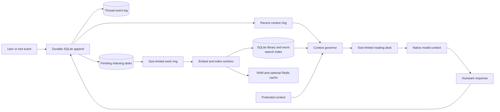

# The Library of Context

[](https://github.com/hwillGIT/library-of-context/actions/workflows/test.yml)
[](https://www.python.org/)
[](LICENSE)
[](ARCHITECTURE.md)

**Virtual memory for artificial intelligence context: stored outside the model and size-limited inside it.**


An artificial intelligence (AI) model can process only a limited amount of context in each request. Context is the information that the model receives.

A model counts text in units called tokens. Long conversations can exceed the model's token limit.

The host can remove old information or replace it with a shorter summary. The Library provides another method for calls through its context governor.

A context governor controls which stored information enters a model request. An event is one message, instruction, tool result, or other ordered item.

The governor stores each event in SQLite. SQLite is a database that stores its data in a local file.

The governor constructs a size-limited request from protected events, recent events, and retrieved records.

Think of the model context as a reading desk with limited space. The Library can hold more books than the desk.

The librarian selects only the books for the current task. A task change replaces the desk instead of adding another desk.

> [!IMPORTANT]
> This project expands **addressable context**, which is stored information that the Library can retrieve. It does not change the model's context limit.
>
> The project supports local prototypes and collaboration. It is not a production service for unrelated users or organizations.
>
> See [Capability Status](docs/STATUS.md) for the support limits.

## Why this is different from ordinary compaction

Conventional compaction replaces a growing transcript with a shorter continuation. This shorter form can omit details from the active work.

The Library uses reversible semantic paging. Semantic paging selects stored information by meaning and makes that information available to the model:

In this guide, **durable** means that SQLite retains the data after a process restart. A **ring** is an ordered memory area with a fixed capacity.

An embedder converts text into numeric representations for similarity searches. A cache keeps temporary copies of frequently used data.

```text
traditional:  growing transcript -> compacted transcript -> continue

Library:      durable event log -> size-limited recent/protected context
                       |                    + relevant retrieved books
                       +-----------> fresh model request on every turn
```

The Library retains the original events for inspection and recovery. A summary can help a search without becoming the only stored copy.

The [related-work landscape](docs/RELATED_WORK.md) compares this design with other context-management methods. These methods include retrieval, prompt compression, compaction, agent memory, checkpoints, and long model contexts.

In this project, **compaction** means a shorter continuation that can omit details. Another storage layer must retain the originals to keep them independently retrievable.

## Capabilities

- A context governor that uses `prepare -> model call -> commit`.
- SQLite storage for thread events and pending indexing tasks.
- A size-limited recent ring for immediate access to newly stored events.
- A size-limited work ring with SQLite recovery for excess or interrupted indexing work.
- Protected context for instructions, decisions, active plans, and unresolved state.
- Status positions for recorded, embedded, and indexed events.
- Queue health and prompt-size status.
- A new size-limited prompt envelope for each governed call.
- Retrieval that combines numeric text similarity, full-text search, importance, and age.
- A byte-limited cache in process random-access memory (RAM).
- An optional local Redis cache for frequently used data.
- Desk change reports named `swapped_in`, `swapped_out`, and `retained`.
- Python, local Hypertext Transfer Protocol (HTTP), and command-line interface (CLI) integration.
- A standard-input-and-output Model Context Protocol (MCP) server.
- A built-in hashing embedder and an optional local Ollama embedder.

A recent ring retains the newest thread events. The Library can reconstruct cache data from SQLite.

The governor operates automatically when an agent gateway routes every turn through it. A gateway is software that sends requests between an agent and a model.

An MCP-only integration provides cooperative memory. The host can use storage and desk tools, but a tool cannot change the request that invoked it.

The Library does not use an undocumented internal compaction interface.

## Architecture at a glance



| Library metaphor | Implementation |
|---|---|
| Reading desk | Size-limited prompt sent to the model |
| Book | Public application programming interface (API) view of one `ContextRecord`, not a separate stored item |
| Catalog | Stored set of searchable records and their descriptive data |
| Nearby stacks | Process RAM and optional local Redis |
| Shelves | Durable SQLite backing store |
| Librarian | Context governor and retrieval policy |
| Book cart | Size-limited ring for background work |
| Checkout ledger | Durable thread event log and pending-work table |

Three terms identify the durable data models. The [glossary](docs/GLOSSARY.md) defines other shared terms.

The [technical language guide](docs/TECHNICAL_LANGUAGE.md) defines the writing rules for repository documentation.

- A **context event** is an ordered source item in one governed chat thread. It can contain a message, instruction, or tool result.
- A **context record** is a searchable unit. It contains text, a numeric embedding, metadata, origin data, and a visibility scope.
- A document can produce multiple context records.
- A **book** is the public representation of one context record. The MCP and Library APIs use this term.
- SQLite does not store a second book item.

Metadata describes a record, such as its source or document type. A visibility scope identifies the thread, project, or team that can retrieve it.

Indexing an event creates a record that is visible to its thread. The event preserves order and recovery state.

The record makes the event content searchable. The durable event reserves the record identifier.

A direct record write cannot replace this searchable copy.

## Quick start

The default configuration requires Python 3.11 or a newer version. Redis is optional.

On Windows PowerShell:

```powershell
git clone https://github.com/hwillGIT/library-of-context.git
cd library-of-context
py -3.11 -m venv .venv
.\.venv\Scripts\python.exe -m pip install -e .
.\.venv\Scripts\python.exe -m library_of_context quickstart
```

On macOS or Linux:

```bash
git clone https://github.com/hwillGIT/library-of-context.git
cd library-of-context
python3 -m venv .venv
.venv/bin/python -m pip install -e .
.venv/bin/python -m library_of_context quickstart
```

The quickstart tests protected context, prompt construction, event storage, search indexing, and cleanup. It uses a temporary database.

It does not use Redis, Docker, a cloud service, or a model API. Continue with the [installation guide](docs/GETTING_STARTED.md).

## Add it to an agent you already run

| Integration point | Behavior |
|---|---|
| Existing MCP-capable agent | Provide cooperative storage, retrieval, and desk replacement |
| Python or HTTP gateway that owns every model call | Control context size through `prepare -> model -> commit` |
| Closed host with no MCP and no model-call hooks | No transparent integration |

See [Add the Library to your agent](docs/ADD_TO_YOUR_AGENT.md) for Codex, Python, and HTTP configuration examples.

Restart the client after you configure the MCP server. Alternatively, start a separate session.

The configuration does not affect a running chat.

### How a chat maps to the Library

One chat thread has the stable identity `ThreadKey(collection, session_id)`. Reuse the same pair for every turn in that chat.

Give each different chat a different `session_id`. Use a different `collection` for a separate project or privacy boundary.

A chat does not receive a separate SQLite database, Redis instance, cache, worker pool, or desk scheduler. One `LibraryRuntime` owns these process resources.

Each active chat uses a size-limited recent ring and an operation lock. It can also use a size-limited desk snapshot.

The Library removes idle thread state from RAM. It reconstructs the state from SQLite when the chat resumes.

Embedded MCP mode creates one runtime for each MCP server process. A daemon is a background process that owns shared resources.

Use the loopback daemon when several local agents must share one runtime:

```text
agent A --thin MCP bridge--\
agent B --thin MCP bridge----> one loopback daemon -> one runtime -> one SQLite database
agent C --thin MCP bridge--/
```

Every Library runtime takes the database owner lock before it opens SQLite. This lock permits only one runtime owner for each database.

Do not start two embedded processes for the same database. Do not combine an embedded process and a daemon for the same database.

Route all clients through one daemon instead.

The daemon accepts local loopback connections. A loopback address sends traffic only inside the local computer.

Every request requires a bearer token from a file that only the owner can read.

A bearer token is a secret value that grants access to its holder. The daemon rejects requests that originate in a browser.

The daemon has no Transport Layer Security (TLS) or authorization for individual users. Do not forward or expose its port.

See the [agent integration guide](docs/ADD_TO_YOUR_AGENT.md) for the daemon command and MCP configuration.

### Run an automatically governed Python text agent

```python
from library_of_context import GovernedTextAgent, LibraryOfContext


def call_my_model(messages: list[dict[str, str]]) -> str:
    return my_model_client.generate(messages=messages)


with LibraryOfContext("data/library.sqlite", redis_url="") as library:
    with library.open_context_governor(
        "agent-thread-42",
        token_budget=12_000,
        recent_token_budget=4_000,
        protected_token_budget=2_000,
    ) as context:
        context.protect(
            "Production changes require a canary wave.",
            label="deployment-policy",
        )

        agent = GovernedTextAgent(
            context,
            call_my_model,
            system_prompt="Work carefully and cite retrieved project evidence.",
        )
        response = agent.turn(
            "Diagnose the deployment failure.",
            turn_id="request-0001",
        )
        context.flush(timeout=5)
        print(context.status()["watermarks"])
```

The callback must send exactly the supplied `messages`. It must not append another transcript or continue a provider-managed conversation.

The built-in adapter supports text only. Structured tool calls, streams, attachments, and content with multiple media types require a custom conversion adapter.

See [Context Governor](docs/CONTEXT_GOVERNOR.md) for the complete protocol.

## MCP integration

For a normal MCP agent, use the project-specific template in [integrations/README.md](integrations/README.md). Merge the supplied agent instructions into the target project.

This configuration provides cooperative memory. It does not control the transcript that the host manages.

Run the standard-input-and-output server directly for inspection:

```bash
python -m library_of_context.mcp_server --no-redis
```

A custom MCP gateway can use these tools when it controls every model call:

| Tool | Use |
|---|---|
| `library_context_prepare` | Store the user turn and construct the size-limited next request |
| `library_context_commit` | Record the assistant or tool result |
| `library_context_protect` | Keep critical state available for every prompt |
| `library_context_release` | Return protected state to normal paging |
| `library_context_status` | Inspect completed event positions, queue pressure, and worker health |
| `library_context_flush` | Wait until indexing reaches the recorded event position |

The Library provides storage, retrieval, reading-desk, stateless-session, and governor tools. A stateless session does not use provider-managed conversation history.

Enable gateway-only tools only in a host that sends the returned `messages` as the complete next model request.

## Local HTTP API

```bash
python -m library_of_context --no-redis serve
```

The command prints the bearer-token file path. Every HTTP request must send the token as `Authorization: Bearer <token>`.

The default token file is `<database-path>.daemon-token`.

The governor endpoints are:

| Method | Path | Purpose |
|---|---|---|
| `POST` | `/context/prepare` | Store the event and construct a size-limited prompt |
| `POST` | `/context/commit` | Store an assistant response or tool result |
| `POST` | `/context/protect` | Add protected context |
| `POST` | `/context/release` | Release protected context |
| `POST` | `/context/flush` | Wait for background indexing to make records searchable |
| `GET` | `/context/status/{session}` | Inspect governor state and completed event positions |

The `/books`, `/library/ingest`, `/catalog/query`, and `/desk/*` routes provide lower-level Library operations. Their scope fields control thread, project, and team visibility.

The HTTP routes and Python API apply the same visibility rules. The server listens only on the local loopback address.

It authenticates local clients with one daemon bearer token. The token does not prove a user identity or team membership.

The Library treats supplied team identifiers as trusted routing data. The HTTP boundary has no TLS and rejects browser-origin requests.

Do not expose it directly to another computer.

Search and desk responses use size-limited excerpts and small record references. They omit embeddings, complete metadata, and complete book text.

Commit and protect responses acknowledge the stored event and state. They do not repeat event content or metadata.

The size-limited `context` field is ready for a prompt. Direct record administration routes return complete records.

## Storage hierarchy

1. **Recent ring:** Store ordered events for one thread in RAM.
   Limit the ring by event count and estimated token count.
   Keep a marked, shortened RAM copy when one event exceeds the ring limit.
   Keep the complete event in SQLite.
   Apply a separate fixed limit when you construct a prompt.
   Preserve conversation order instead of least-recently-used order.
2. **Process RAM:** Cache frequently used books and search results within a byte limit.
3. **Local Redis:** Optionally cache books, queries, desks, and expiration times for one runtime.
4. **SQLite:** Store the required events, pending work, text, metadata, search index, and numeric vectors.

Redis contains temporary cache data. Each runtime uses a random, versioned keyspace.

A keyspace is the set of Redis keys that belong to one runtime. A restarted process starts with an empty cache.

The runtime ignores data from another runtime. The default Redis configuration is not a durable message broker.

A message broker transfers messages between independent processes. Do not use this Redis cache as the team event stream.

### Free local Redis on Windows

Docker and a cloud account are not required. Windows Subsystem for Linux (WSL) runs a Linux environment on Windows.

The PowerShell installer creates the authenticated `library-of-context-redis` service in Ubuntu WSL. The service listens on port 6380.

The installer does not change the default Redis service in Ubuntu. It requires WSL 2 and an Ubuntu distribution.

It also requires systemd, which manages background services in Linux.

```powershell
powershell -ExecutionPolicy Bypass -File .\scripts\install-local-redis.ps1
$env:LIBRARY_OF_CONTEXT_REDIS_URL = 'redis://:<password-printed-by-installer>@127.0.0.1:6380/0'
.\.venv\Scripts\python.exe -m library_of_context --db data/redis-check.sqlite doctor
```

Run the environment assignment that the installer prints. The placeholder in the example is not a credential.

The dedicated instance uses a one-gibibyte least-frequently-used cache by default. It disables Redis persistence and keeps the required data in SQLite.

Use `-MaxMemory`, `-Port`, and `-Password` to override these settings.

`doctor` opens the configured SQLite database and checks each storage level. The example creates `data/redis-check.sqlite`.

Use `--no-redis` when SQLite and process RAM meet the workload requirements.

## Performance limits

Prompt construction has a fixed size limit. A database transaction stores each event with its pending indexing task.

Full-text search returns a size-limited set of possible matches. Numeric vector retrieval compares every live record in a namespace.

Claims about large catalogs require measurements. Use a size-limited vector-search adapter when complete comparison exceeds an accepted limit.

An adapter is a component that connects the Library to an alternative search implementation.

[Performance and Scaling](docs/PERFORMANCE_AND_SCALING.md) defines measurements, service-level objectives, and benchmark questions. A service-level objective states a measurable target for system behavior.

[Why These Improvements?](docs/WHY_THE_ROADMAP.md) compares alternatives and defines adoption conditions. The [Roadmap](ROADMAP.md) identifies conditional work.

## Documentation

| Document | Purpose |
|---|---|
| [Architecture](ARCHITECTURE.md) | Invariants, tiers, consistency, and evolution |
| [Related Work and Design Landscape](docs/RELATED_WORK.md) | Primary-source comparison with adjacent context and memory approaches |
| [Context Governor](docs/CONTEXT_GOVERNOR.md) | Prepare/commit protocol and failure behavior |
| [Capability Status](docs/STATUS.md) | Implemented, experimental, planned, and unsupported boundaries |
| [System Explainer](docs/LIBRARY_OF_CONTEXT_EXPLAINER.md) | Didactic visual walkthrough |
| [Performance and Scaling](docs/PERFORMANCE_AND_SCALING.md) | Measured evidence, non-functional requirements, and benchmark acceptance conditions |
| [Why These Improvements?](docs/WHY_THE_ROADMAP.md) | Rationale, counterarguments, alternatives, and adoption triggers |
| [Team Architecture](docs/TEAM_ARCHITECTURE.md) | Local-first collaboration and promotion design |
| [Roadmap](ROADMAP.md) | Milestones and open research questions |
| [Decision Brief Template](docs/DECISION_BRIEF_TEMPLATE.md) | Required “why / why not / evidence” format for major proposals |
| [Contributor quality-assurance workflow](docs/DEVELOPMENT_WORKFLOW.md) | Contract, migration, concurrent-operation, failure, review, and release checks |
| [Thread Scope and Shared Runtime decision record](docs/adr/0001-thread-scope-and-shared-runtime.md) | Required identity, visibility, ownership, and rollback rules |
| [Contributing](CONTRIBUTING.md) | Development workflow and contribution areas |
| [Security](SECURITY.md) | Threat model and vulnerability reporting |

## Help shape the design

The project invites contributions to these design questions:

- Which policy should protect context automatically, and who may release that context?
- How should maintainers measure retrieval quality for agent threads rather than document question answering?
- Which local approximate-nearest-neighbor search adapter works for 100,000 to 1,000,000 text parts?
- How should branches inherit, supersede, and merge context?
- Which knowledge is safe and useful to promote from a private thread to a team catalog?
- Should the shared event transport use Redis Streams, NATS JetStream, or another message broker?
- How should an access-control-list change remove prohibited local cache entries?
- How can that removal keep cloud services outside the time-critical prompt path?
- What token-pressure policy feels predictable to users across different model
  tokenizers?

See [ROADMAP.md](ROADMAP.md) for more questions. Contributions can include benchmark results, design notes, adapters, failure tests, and technical criticism.

## Contributing

Read [CONTRIBUTING.md](CONTRIBUTING.md). Open a research question or design proposal.

Keep each pull request focused on one technical purpose. Useful contributions include reproducible retrieval benchmarks and approximate-nearest-neighbor search adapters.

A pull request proposes a set of repository changes for review. A benchmark is a repeatable measurement under a defined workload.

Other useful contributions include tokenizer integrations, privacy reviews, failure tests, and agent gateway adapters. A tokenizer divides text into model input units.

## License

[MIT](LICENSE) © Library of Context contributors.
