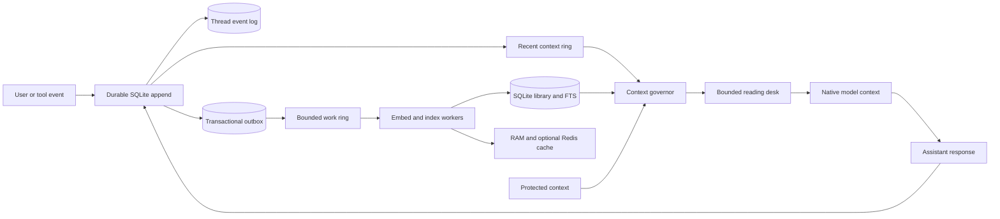

# The Library of Context

[](https://github.com/hwillGIT/library-of-context/actions/workflows/test.yml)
[](https://www.python.org/)
[](LICENSE)
[](ROADMAP.md)
[](ARCHITECTURE.md)

**Virtual memory for AI context: durable outside the model, bounded inside it.**


An AI model has a finite native context window. Long conversations eventually expand
until old information is truncated or compacted. For calls routed through its context
governor, the Library stores each recorded event in SQLite and assembles a bounded model
request from protected events, recent events, and retrieved records.

Think of the model's context window as a reading desk. The Library can hold far more
books than the desk, but the librarian lays out only the books needed for the current
task. Changing the task replaces the desk; it does not pile more books on top.

> [!IMPORTANT]
> This project expands **addressable context**, not a model's physical context-window
> limit. It is an experimental alpha: useful for local prototypes and collaboration,
> but not yet a production multi-tenant memory service.

## Why this is different from ordinary compaction

Conventional compaction turns a growing transcript into a smaller, lossy continuation
and may leave the original details outside the active workflow. The Library uses
reversible semantic paging:

```text
traditional:  growing transcript -> compacted transcript -> continue

Library:      durable event log -> bounded recent/protected context
                       |                    + relevant retrieved books
                       +-----------> fresh model request on every turn
```

Original events remain inspectable and recoverable. Summaries may become navigation
aids, but they do not need to be the only surviving copy.

The [related-work landscape](docs/RELATED_WORK.md) compares this design with model
long-context methods, retrieval, prompt compression, provider compaction, agent memory,
checkpointing, and inference-runtime paging. Here, “compaction” means a smaller,
potentially lossy continuation representation whose originals are not independently
addressable unless another layer retains them.

## What is implemented

- A **context governor** with `prepare -> model call -> commit` lifecycle operations.
- Durable SQLite thread events and a transactional indexing outbox.
- A token-targeted, event-bounded recent ring for immediate read-your-own-context
  behavior; an oversized event is truncated only in the model envelope, not on disk.
- A bounded work ring with a durable SQLite outbox for overflow and restart recovery.
- Protected context for instructions, decisions, active plans, and unresolved state.
- Recorded, embedded, and indexed watermarks with queue-health status.
- Fresh, bounded prompt envelopes that replace transcript growth.
- Hybrid vector, SQLite FTS5, importance, and recency retrieval.
- Byte-bounded process RAM and optional disposable local Redis hot tiers.
- Reading-desk swap reports: `swapped_in`, `swapped_out`, and `retained`.
- Python, local HTTP, CLI, and STDIO MCP integration surfaces.
- Dependency-free hashing embeddings and an optional local Ollama adapter.

The governor is automatic when your agent or model gateway routes every turn through
it. An MCP-only integration is cooperative: the host can use shelving and reading-desk
tools, but it cannot rewrite the model request that already invoked a tool or replace an
undocumented internal compaction hook.

## Architecture at a glance



| Library metaphor | Implementation |
|---|---|
| Reading desk | Strictly bounded prompt sent to the model |
| Book | A context record with text, provenance, metadata, and embedding |
| Catalog | Hybrid lexical and vector retrieval |
| Nearby stacks | Process RAM and optional local Redis |
| Shelves | Durable SQLite backing store |
| Librarian | Context governor and retrieval policy |
| Book cart | Bounded asynchronous work ring |
| Checkout ledger | Durable thread event log and outbox |

## Quick start

The default configuration requires only Python 3.11 or newer. Redis is optional.

On Windows PowerShell:

```powershell
git clone https://github.com/hwillGIT/library-of-context.git
cd library-of-context
py -3.11 -m venv .venv
.\.venv\Scripts\python.exe -m pip install -e .
.\.venv\Scripts\python.exe -m library_of_context quickstart
```

On macOS or Linux:

```bash
git clone https://github.com/hwillGIT/library-of-context.git
cd library-of-context
python3 -m venv .venv
.venv/bin/python -m pip install -e .
.venv/bin/python -m library_of_context quickstart
```

The quickstart exercises protection, prompt assembly, event recording, indexing, and
cleanup with a temporary database. It uses no Redis, Docker, cloud service, or model API.
Continue with the [installation guide](docs/GETTING_STARTED.md).

## Add it to an agent you already run

| Your integration point | Result |
|---|---|
| Existing MCP-capable agent | Cooperative shelving, retrieval, and reading-desk replacement |
| Python or HTTP gateway that owns every model call | Automatic bounded context through `prepare -> model -> commit` |
| Closed host with no MCP and no model-call hooks | No transparent integration |

See [Add the Library to your agent](docs/ADD_TO_YOUR_AGENT.md) for Codex, Python, and HTTP
configuration examples. A newly configured MCP server requires a client restart or new
session; it cannot be injected into a chat already in progress.

### Run an automatically governed Python text agent

```python
from library_of_context import GovernedTextAgent, LibraryOfContext


def call_my_model(messages: list[dict[str, str]]) -> str:
    return my_model_client.generate(messages=messages)


with LibraryOfContext("data/library.sqlite", redis_url="") as library:
    with library.open_context_governor(
        "agent-thread-42",
        token_budget=12_000,
        recent_token_budget=4_000,
        protected_token_budget=2_000,
    ) as context:
        context.protect(
            "Production changes require a canary wave.",
            label="deployment-policy",
        )

        agent = GovernedTextAgent(
            context,
            call_my_model,
            system_prompt="Work carefully and cite retrieved project evidence.",
        )
        response = agent.turn(
            "Diagnose the deployment failure.",
            turn_id="request-0001",
        )
        context.flush(timeout=5)
        print(context.status()["watermarks"])
```

The callback must send exactly the supplied `messages`; it must not append another
transcript or continue a provider-managed conversation. The built-in adapter is text
only. Structured tool calls, streams, attachments, and multimodal content need a custom
serialization adapter.

See [Context Governor](docs/CONTEXT_GOVERNOR.md) for the complete protocol.

## MCP integration

For a normal MCP agent, use the project-isolated template and ready-to-merge agent
instructions in [integrations/README.md](integrations/README.md). This is cooperative
memory; it does not control the host's native transcript.

The raw local STDIO server can be inspected with:

```bash
python -m library_of_context.mcp_server --no-redis
```

Custom MCP gateways that own the model-call boundary can use:

| Tool | Use |
|---|---|
| `library_context_prepare` | Record the user turn and build the bounded next request |
| `library_context_commit` | Record the assistant or tool result |
| `library_context_protect` | Keep critical state eligible for every prompt |
| `library_context_release` | Return protected state to normal paging |
| `library_context_status` | Inspect watermarks, queue pressure, and worker health |
| `library_context_flush` | Wait for indexing to reach the recorded watermark |

Traditional shelving, retrieval, reading-desk, and stateless-session tools remain
available. Do not enable the gateway-only tools in a host that cannot send their
returned `messages` as the complete next model request.

## Local HTTP API

```bash
python -m library_of_context --no-redis serve
```

The governor endpoints are:

| Method | Path | Purpose |
|---|---|---|
| `POST` | `/context/prepare` | Durable append plus bounded prompt construction |
| `POST` | `/context/commit` | Durable assistant/tool result append |
| `POST` | `/context/protect` | Add protected context |
| `POST` | `/context/release` | Release protected context |
| `POST` | `/context/flush` | Wait for asynchronous index visibility |
| `GET` | `/context/status/{session}` | Inspect governor state and watermarks |

The existing `/books`, `/library/ingest`, `/catalog/query`, and `/desk/*` routes expose
the lower-level library. The server binds to loopback and has no authentication. Do not
expose it directly to another machine.

## Storage hierarchy

1. **Recent ring:** per-thread ordered events, bounded by event count and an estimated-
   token target. One oversized event may remain resident so fresh context is visible;
   prompt assembly still truncates its model-visible view to the hard envelope budget.
   This is not an LRU; conversation order matters.
2. **Process RAM:** byte-bounded LRU for hot books and retrieval results.
3. **Local Redis:** optional shared cache for hot books, queries, desks, TTLs, and
   invalidation generations.
4. **SQLite:** authoritative events, outbox, text, metadata, FTS, and vector storage.

Redis is disposable. The default local Redis configuration is not a
durable message broker and should not be used as the team event stream.

### Free local Redis on Windows

Docker and a cloud account are not required. The included PowerShell script installs a
Redis service inside Ubuntu WSL. It requires WSL 2, an Ubuntu distribution, and systemd:

```powershell
powershell -ExecutionPolicy Bypass -File .\scripts\install-local-redis.ps1
.\.venv\Scripts\python.exe -m library_of_context --db data/redis-check.sqlite doctor
```

`doctor` opens the configured SQLite database while checking the storage tiers. The
example above creates `data/redis-check.sqlite`.

Use `--no-redis` everywhere if SQLite plus process RAM is sufficient.

## Performance status

The bounded prompt and event/outbox path work. The FTS candidate join that previously
caused near-quadratic common-term behavior has been removed. Vector retrieval still
exact-scores every live record in a namespace, so large catalogs require an ANN adapter
before production-scale claims are justified.

Current priorities include bounded candidate generation, model-accurate tokenization,
batch embeddings, a single workstation daemon, ACL-aware scope routing, and a durable
selective team-promotion plane. Measurements, proposed SLOs, and benchmark questions are
in [Performance and Scaling](docs/PERFORMANCE_AND_SCALING.md).

These priorities are conditional, not a requirement to install every subsystem. Exact
search may be best for a small catalog; an embedded process may be best for one agent;
Redis may add no value after daemon consolidation; and a broker or cloud plane belongs
only in a real multi-node team workload. [Why These Improvements?](docs/WHY_THE_ROADMAP.md)
explains the case for and against each change, alternatives, adoption triggers, and
evidence gates.

## Documentation

| Document | Purpose |
|---|---|
| [Architecture](ARCHITECTURE.md) | Invariants, tiers, consistency, and evolution |
| [Related Work and Design Landscape](docs/RELATED_WORK.md) | Primary-source comparison with adjacent context and memory approaches |
| [Context Governor](docs/CONTEXT_GOVERNOR.md) | Prepare/commit protocol and failure behavior |
| [Capability Status](docs/STATUS.md) | Implemented, experimental, planned, and unsupported boundaries |
| [System Explainer](docs/LIBRARY_OF_CONTEXT_EXPLAINER.md) | Didactic visual walkthrough |
| [Performance and Scaling](docs/PERFORMANCE_AND_SCALING.md) | Audit evidence, NFRs, and benchmark gates |
| [Why These Improvements?](docs/WHY_THE_ROADMAP.md) | Rationale, counterarguments, alternatives, and adoption triggers |
| [Team Architecture](docs/TEAM_ARCHITECTURE.md) | Local-first collaboration and promotion design |
| [Roadmap](ROADMAP.md) | Milestones and open research questions |
| [Decision Brief Template](docs/DECISION_BRIEF_TEMPLATE.md) | Required “why / why not / evidence” format for major proposals |
| [Contributing](CONTRIBUTING.md) | Development workflow and contribution areas |
| [Security](SECURITY.md) | Threat model and vulnerability reporting |

## Help shape the design

Open design questions include:

- Which context should be protected automatically, and who may release it?
- How should retrieval quality be measured for agent threads rather than document QA?
- What is the right local ANN adapter for 100,000 to 1,000,000 chunks?
- How should branches inherit, supersede, and merge context?
- Which knowledge is safe and useful to promote from a private thread to a team catalog?
- Should the shared event plane use Redis Streams, NATS JetStream, or another broker?
- How should ACL revocation invalidate local caches without putting the cloud in the
  prompt critical path?
- What token-pressure policy feels predictable to users across different model
  tokenizers?

The longer list is in [ROADMAP.md](ROADMAP.md). Questions, benchmark results, design
notes, adapters, failure tests, and critiques are welcome.

## Contributing

Read [CONTRIBUTING.md](CONTRIBUTING.md), open a research question or design proposal,
and keep pull requests focused. The project particularly welcomes reproducible
retrieval benchmarks, ANN adapters, tokenizer integrations, privacy reviews, queue and
crash tests, and agent-framework gateways.

## License

[MIT](LICENSE) © Library of Context contributors.
