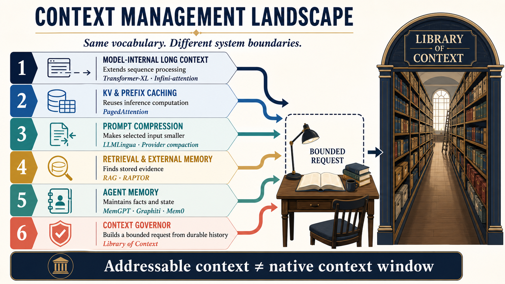
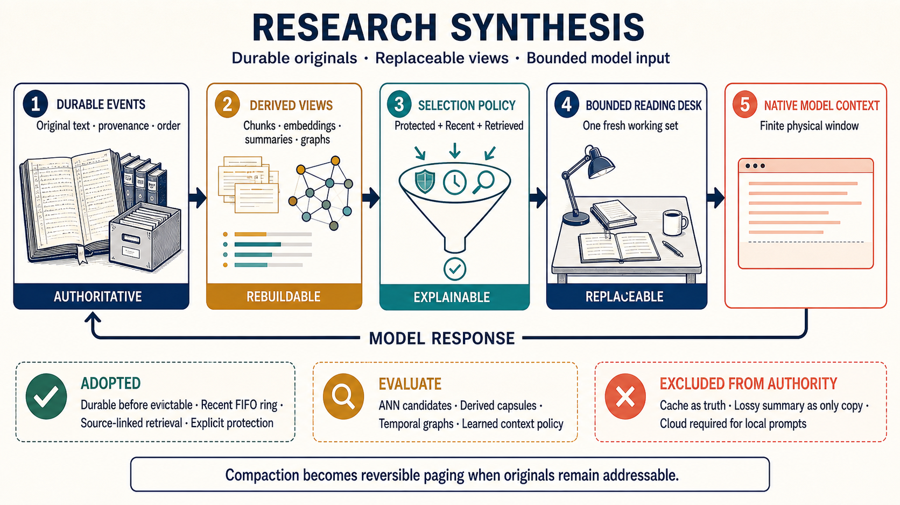

# Context Management: Related Systems and Boundaries

Context management includes several mechanisms at different system layers. These mechanisms manage different types of state and provide different guarantees.

A token is a small text unit that a model processes. A model request contains a sequence of tokens.

SQLite is the embedded database that stores authoritative Library data in one file.

A larger model window, an inference cache, prompt compression, retrieval, agent memory, and a context governor solve different problems. One mechanism cannot replace every other mechanism.

This comparison uses primary sources. These sources include research papers, author preprints, official documentation, and official project repositories.

A preprint is a paper that a publisher has not formally reviewed or published. Official interface documentation defines the behavior that an implementation promises.

Documentation that can change includes an access date. The comparison does not directly compare results from different datasets, models, or hardware.

Each research summary includes a system-boundary statement. This statement explains how the cited mechanism relates to the Library. It is not a claim from the cited authors.

The [Glossary](GLOSSARY.md) defines shared terms. Project specifications include [capability status](STATUS.md), [architecture](architecture.md), [design rationale](WHY_THE_ROADMAP.md), [roadmap](roadmap.md), and [decision criteria](DECISION_BRIEF_TEMPLATE.md).

## Mechanisms and system boundaries

| Term | Meaning in this project |
|---|---|
| Native context window | Tokens that a model can process in one request |
| Addressable context | Information that an application can retrieve for a later request |
| Semantic paging | Selection of protected, recent, and relevant records for one bounded request |
| Compaction | Replacement of prior request history with a smaller continuation state |
| Prompt compression | Removal or rewriting of prompt tokens to reduce request size |
| Checkpoint | Stored workflow or conversation state that permits later resumption |
| Prompt or prefix cache | Reused model computation for an identical token prefix |
| Key-value-cache paging | Movement and allocation of model attention data during inference |

Inference is the process in which a trained model produces an output. Attention data records how the model relates input positions during generation.

The Library manages addressable context at the application boundary. It does not enlarge the model window, change model attention, or manage inference memory.

*Similar memory terms identify different state and intervention boundaries.*

## Library system boundary

The Library operates between an application and a model call. It records each governed event in an authoritative SQLite log.

Storage completes before an event can leave the model-visible working set. Protected events, a bounded recent ring, and retrieved records form each bounded request.

The recent ring uses first-in, first-out order. This order removes the oldest event first when the ring reaches its limit.

Derived indexes and random-access memory entries are disposable. Redis is an optional in-memory key-value cache. The system can rebuild these entries from authoritative records.

Automatic governance requires an application or gateway that controls the complete model request.

Model Context Protocol (MCP) defines an interface for agent tools and resources. MCP-only use remains cooperative because a tool cannot replace a closed host's internal transcript.

The Library does not change model architecture, allocate inference pages, or enlarge the physical token window.

## Model-internal long-context memory

### Recurrent and compressed model state

A Transformer is a neural-network architecture that uses attention to relate input positions.

**Evidence.** Transformer-XL carries hidden state between input segments.[^transformer-xl] Hidden state is an internal numeric representation produced by the model.

Compressive Transformer stores compressed older activations.[^compressive-transformer] An activation is an intermediate numeric value inside a neural network.

Recurrent Memory Transformer carries learned memory tokens between segments.[^rmt] Infini-attention combines local attention with compressed memory inside the attention mechanism.[^infini-attention]

These methods change model architecture, training, or inference behavior.

**System boundary.** These methods can extend sequence reach for a controlled model. They do not provide a provider-independent, inspectable event store.

The Library can operate with these methods. Its durable text, provenance, deletion, and retrieval rules remain outside the model.

Provenance records where information came from.

### Sliding windows and streaming inference

Streaming inference produces output while a model continues processing. A sliding window retains only a moving region of recent input.

**Evidence.** StreamingLLM retains attention-sink tokens and a recent window.[^streamingllm] Attention-sink tokens stabilize attention when older tokens leave the window.

The method supports generation beyond the model's training length.

**System boundary.** The recent ring also bounds recent state, but it operates in the application.

A sliding inference cache cannot recover the meaning of discarded events. Older information needs an external source and a selection policy.

## Retrieval and external memory

### Retrieval-augmented generation

Retrieval-augmented generation (RAG) places retrieved source information into a model request.

**Evidence.** RAG combines a trained generator with an external dense document index.[^rag] A dense index searches numeric vectors that represent meaning.

RETRO retrieves nearby chunks from a large corpus. Its training teaches the model architecture to use those chunks.[^retro]

Self-RAG trains a model to decide when to retrieve. It also trains the model to assess retrieved evidence.[^self-rag]

RAPTOR clusters source text and creates a hierarchy of summaries. Retrieval can select information from several levels.[^raptor]

**System boundary.** These works show how retrieval can keep information outside the active request.

Agent threads add other requirements. They need immediate event visibility, order, replacement rules, protected instructions, repeat-safe processing, and strict prompt limits.

Hierarchical summaries can help navigation. Their source events must remain addressable.

### Long-term model memory

**Evidence.** Memorizing Transformers use approximate nearest-neighbor lookup over stored key and value pairs from prior training batches.[^memorizing-transformers]

Approximate nearest-neighbor search finds likely vector matches without scoring every vector.

LongMem separates a fixed language-model core from a trained memory network. The memory network retrieves older context.[^longmem]

**System boundary.** Both works separate active model state from larger memory.

Their learned representations cannot serve as this project's only authoritative record. Embeddings and indexes must remain versioned derivatives of durable text and metadata.

An embedding is a numeric representation of text meaning.

## Agent memory and active context management

### Explicit memory tiers and reflective memory

Reflective memory derives higher-level observations from stored events.

**Evidence.** Generative Agents retrieve observations with recency, importance, and relevance. They create reflections for later planning.[^generative-agents]

MemoryBank combines conversation storage, summaries, retrieval, and a rule-based forgetting and reinforcement policy.[^memorybank]

MemGPT presents an operating-system analogy. It uses memory tiers, interrupts, and model-directed movement between working and external context.[^memgpt]

**System boundary.** MemGPT is the closest research precedent for the Library's virtual-memory metaphor.

The Library imposes explicit storage and capacity rules. It stores each event before eviction. It also bounds the recent ring and work ring.

Summaries remain derived records. They do not become the only continuation state.

Reflection and forgetting require research evidence. They can preserve errors or remove details that become important later.

### Temporal and graph memory

A temporal graph represents entities, relationships, and the periods when facts apply.

**Evidence.** The Zep paper and Graphiti represent episodes, entities, and time-qualified relationships in an incrementally maintained knowledge graph.[^zep-paper][^graphiti]

An episode is one recorded event or interaction. A knowledge graph stores facts as nodes and relationships.

Mem0 extracts and consolidates selected memories. Its documented pipeline supports vector retrieval and graph retrieval.[^mem0-paper][^mem0-docs]

**System boundary.** Temporal graphs can help retrieve changing facts, relationships, and replacements.

Extracted facts remain derived state. They must retain links to original records. They must not silently replace the thread log.

Graph storage adds schema, consistency, and operating costs. Adoption needs measured benefit.

### Agent-directed context operations

Several systems expose memory management as an agent action or learned policy:

- **Sculptor** gives an agent tools to divide, summarize, hide, restore, and search context.[^sculptor]
- **Memory-R1** uses reinforcement learning for memory construction and use.[^memory-r1]
- **Agentic Context Management** lets an agent move selected context to external memory and retrieve it later.[^acm]
- **Context Folding** runs a subtask in a branch and replaces that branch with a concise result.[^context-folding]
- **MemOS** proposes an operating-system interface for text, activation, and model-parameter memory.[^memos]

Reinforcement learning trains behavior through rewards. Model-parameter memory stores information in learned model weights.

The Context Folding OpenReview record lists acceptance at the 2026 International Conference on Machine Learning.[^context-folding]

**System boundary.** Protect, release, retrieve, and derive operations fit the Library interface.

A learned policy must not control durable storage, authorization, or irreversible deletion. It can propose a working set or summary.

Each proposal must remain explainable, bounded, and linked to source records.

## Prompt compression and compaction

### Query-aware and learned compression

Query-aware compression changes its output according to the active question. Learned compression uses a trained model to produce a smaller representation.

**Evidence.** LLMLingua removes lower-value prompt tokens within a budget.[^llmlingua] LongLLMLingua adds question-aware compression and document reordering.[^longllmlingua]

Gist tokens and AutoCompressors encode prompts or prior segments into compact learned values.[^gist-tokens][^autocompressors]

RECOMP trains extractive and abstractive compressors for retrieved documents.[^recomp] Extractive compression selects source text. Abstractive compression writes a shorter representation.

**System boundary.** Compression can be the final packing operation after retrieval.

Compression is often specific to one question or loses details. Therefore, it cannot replace the durable event store.

Exact instructions, identifiers, decisions, and evidence need explicit protection or lossless storage.

Every compressor needs task-quality tests and an accurate token budget for the selected model.

### Provider-native continuation management

A provider-native continuation protocol lets a model service manage stored request history.

**Evidence.** The OpenAI Responses interface provides a compact operation. It returns a smaller response representation for later continuation.[^openai-compact]

Anthropic documents server-side compaction and context editing.[^anthropic-compaction][^anthropic-context-editing] These functions summarize older conversation or remove selected tool and reasoning blocks.

**System boundary.** Provider compaction can reduce active provider history when an application uses that provider's continuation protocol.

It does not provide an application-owned, inspectable, and searchable backing store.

The Library can operate with provider compaction. A gateway must state which layer owns history.

The gateway must not send both a governed envelope and a growing transcript. The project cannot replace a closed host's internal compaction function.

## Framework integration surfaces

An agent framework coordinates model calls, tools, storage, and workflows. Frameworks expose different session, retrieval, reduction, checkpoint, and middleware functions.

Middleware runs code before or after another operation. These functions determine where the context governor can intervene.

| Project | Documented context or memory mechanism | Relevant boundary or mechanism |
|---|---|---|
| [Letta](https://github.com/letta-ai/skills/blob/main/letta/letta-api-client/memory-architecture.md) | Core memory stays in context. Archival memory and conversation search stay outside context. | Its tiered memory provides a reference for explicit agent memory controls. |
| [LangGraph](https://docs.langchain.com/oss/python/langgraph/persistence) and [LangChain memory](https://docs.langchain.com/oss/python/concepts/memory) | Thread checkpoints and named cross-thread stores persist state. Applications define trimming and summaries. | The application must define context ownership and paging policy. |
| [LlamaIndex Memory](https://github.com/run-llama/llama_index/blob/main/docs/src/content/docs/framework/module_guides/deploying/agents/memory.mdx) | Bounded short-term memory can move older messages into configurable long-term blocks. | It provides a reference for budgeted movement between memory tiers. |
| [Microsoft Agent Framework](https://learn.microsoft.com/en-us/agent-framework/journey/adding-context-providers) | Sessions and context providers inject state around invocation. Other interfaces provide compaction and checkpoints. | Context-provider hooks can host the Library lifecycle. The framework does not define semantic paging. |
| [OpenAI Agents SDK](https://github.com/openai/openai-agents-python/blob/main/docs/sessions/index.md) | Session backends store conversation history. A compacting session can rewrite continuation state. | Sessions provide an integration point. Semantic retrieval still needs a policy and index. |
| [Graphiti](https://github.com/getzep/graphiti) | An incremental temporal graph supports semantic, lexical, and graph retrieval. | It can serve as a derived temporal index, not the authoritative event log. |
| [Mem0](https://github.com/mem0ai/mem0/blob/main/docs/core-concepts/how-it-works.mdx) | The system extracts, updates, stores, and searches selected memories across scopes. | The caller decides how retrieved results enter the prompt. |
| [AutoGen](https://github.com/microsoft/autogen) | Memory interfaces inject retrieved content. Model-context classes limit messages or tokens. | The application must define semantic page-in policy. |
| [Semantic Kernel](https://learn.microsoft.com/en-us/semantic-kernel/concepts/ai-services/chat-completion/chat-history) | Chat-history reducers truncate or summarize history. Vector stores use a separate interface. | Reduction and vector retrieval operate at separate integration boundaries. |

An adapter needs one clear owner and stable operations before and after each request. It also needs defined retry, streaming, and failure behavior.

Conformance tests must prove that the host does not append another transcript to the governed messages.

## Inference-runtime paging and caching

**Evidence.** PagedAttention applies virtual-memory ideas to inference key-value-cache blocks.[^pagedattention] These blocks store model attention data for generated tokens.

Prompt and prefix caches reuse computation for repeated token prefixes. They do not select new facts from durable agent history.

**System boundary.** PagedAttention and Library semantic paging share a metaphor, not a storage layer.

The inference runtime can discard its pages. Library books remain application records with provenance and lifecycle rules.

Both mechanisms can operate at the same time.

## Evaluation evidence

Long context needs retrieval tests and reading tests. Retrieval tests measure whether the system selects the right evidence. Reading tests measure whether the model uses it.

| Reference | What it measures | Use for this project |
|---|---|---|
| [Lost in the Middle](https://doi.org/10.1162/tacl_a_00638) | Position effects when relevant information appears at different input locations | Test packing order. Do not treat nominal window length as effective recall. |
| [RULER](https://openreview.net/forum?id=kIoBbc76Sy) | Synthetic retrieval, tracing, aggregation, and distractor tasks across context lengths | Use as a controlled reading test. It does not replace realistic tasks. |
| [LongBench](https://aclanthology.org/2024.acl-long.172/) | English and Chinese question answering, summarization, code, and synthetic tasks | Use for broad model regression tests, not as the only agent-memory test. |
| [LoCoMo](https://aclanthology.org/2024.acl-long.747/) | Multi-session questions, time and cause reasoning, and summaries | Test thread recall and order. Its ten base conversations require supplemental data. |
| [LongMemEval](https://openreview.net/forum?id=pZiyCaVuti) | Extraction, multi-session reasoning, time reasoning, updates, and abstention | Separate indexing, retrieval, and answer failures. Add system-level failure tests. |

Abstention means that a model declines to answer when evidence is insufficient.

These benchmarks do not cover every Library requirement. The Library also needs storage, concurrency, authorization, deletion, freshness, and token-limit tests.

Tests must cover process failure, repeated delivery, ring overflow, concurrent writers, obsolete indexes, and local operation during dependency failure.

## Comparison by system boundary

| Approach | Primary state | Intervention point | Missing capability |
|---|---|---|---|
| Longer or recurrent model | Hidden state, activations, or a larger token sequence | Model architecture or inference runtime | Application-owned provenance and lifecycle |
| Key-value-cache paging | Inference attention data | Model server | Semantic retrieval from durable records |
| Prompt or prefix caching | Reusable computation for an identical prefix | Model provider or runtime | New relevance selection and durable memory |
| Prompt compression | Smaller form of selected input | Before a model request | Lossless authoritative history |
| Conversation compaction | Smaller continuation state | Provider or agent session | Independently addressable source events unless the application keeps them |
| Checkpointing | Stored workflow or thread state | Agent runtime | Relevance ranking and bounded evidence packing |
| Document RAG | Retrieved source passages | Before a model request | Agent-event order, protected state, and immediate new-event visibility |
| Library semantic paging | Durable events and selected derived records | Application-owned model-call boundary | A larger native window or control of a closed host |

## System design constraints

*Durable source records are authoritative. Retrieval structures and model working sets are replaceable.*

### Authority rules

An outbox is a durable table of work. A watermark identifies the highest sequence that a processing stage completed without a gap.

- Original events are authoritative. Summaries, embeddings, and graphs are rebuildable derivatives.
- A bounded recent ring supplies new events. Retrieval selects older records.
- Callers can protect selected instructions and decisions.
- The durable outbox provides recovery. The bounded work ring provides dispatch.
- Recorded and indexed watermarks report freshness.
- Provider, Redis, and team services remain outside the local prompt requirement.

A watermark identifies the highest contiguous completed sequence.

### Conditional mechanisms

- A hard provider-token guarantee requires an accurate tokenizer for that provider and model.
- Bounded vector candidates or ANN search require evidence that exact retrieval exceeds a declared latency or memory limit.
- Hierarchical summaries and temporal indexes remain derived views with source links and version identifiers.
- Derived views need explicit rules for contradictory information.
- A framework adapter requires a stable model-call boundary.

A tokenizer converts input text into the token units that a model processes.

### Prohibited authority assignments

- Learned summaries, vectors, and graph facts must not become the only surviving record.
- Redis, a vector index, or a remote service must not become the only source of truth.
- A learned policy must not delete durable records or bypass authorization.
- Documentation must not claim that MCP replaces undocumented host compaction.
- Cloud availability must not become necessary for a local governed prompt.

## Unresolved technical questions

The project needs evidence for these decisions:

1. Which agent-thread corpus measures retrieval, replacement, contradiction, and genuine misses without exposing private production data?
2. When do derived capsules improve continuity over direct source retrieval? How should the interface show capsule errors?
3. Which local vector index preserves sufficient recall with authorization filters on Windows, macOS, and Linux?
4. Which adapters preserve structured tool calls, interrupted streams, retries, and branches without duplicate history?
5. How should provider compaction and Library paging operate together?
6. Which policy protects critical state without allowing protected context to exceed the bounded envelope?

A capsule is a concise derived context record that links to its source records.

## Primary references

[^transformer-xl]: Z. Dai et al., [“Transformer-XL: Attentive Language Models Beyond a Fixed-Length Context”](https://aclanthology.org/P19-1285/), ACL 2019.

[^compressive-transformer]: J. Rae et al., [“Compressive Transformers for Long-Range Sequence Modelling”](https://openreview.net/forum?id=SylKikSYDH), ICLR 2020.

[^rmt]: A. Bulatov, Y. Kuratov, and M. Burtsev, [“Recurrent Memory Transformer”](https://arxiv.org/abs/2207.06881), NeurIPS 2022.

[^infini-attention]: T. Munkhdalai et al., [“Leave No Context Behind: Efficient Infinite Context Transformers with Infini-attention”](https://arxiv.org/abs/2404.07143), 2024.

[^streamingllm]: G. Xiao et al., [“Efficient Streaming Language Models with Attention Sinks”](https://openreview.net/forum?id=NG7sS51zVF), ICLR 2024.

[^rag]: P. Lewis et al., [“Retrieval-Augmented Generation for Knowledge-Intensive NLP Tasks”](https://proceedings.neurips.cc/paper/2020/hash/6b493230205f780e1bc26945df7481e5-Abstract.html), NeurIPS 2020.

[^retro]: S. Borgeaud et al., [“Improving Language Models by Retrieving from Trillions of Tokens”](https://proceedings.mlr.press/v162/borgeaud22a.html), ICML 2022.

[^self-rag]: A. Asai et al., [“Self-RAG: Learning to Retrieve, Generate, and Critique through Self-Reflection”](https://openreview.net/forum?id=hSyW5go0v8), ICLR 2024.

[^raptor]: P. Sarthi et al., [“RAPTOR: Recursive Abstractive Processing for Tree-Organized Retrieval”](https://openreview.net/forum?id=GN921JHCRw), ICLR 2024.

[^memorizing-transformers]: Y. Wu et al., [“Memorizing Transformers”](https://arxiv.org/abs/2203.08913), ICLR 2022.

[^longmem]: W. Wang et al., [“Augmenting Language Models with Long-Term Memory”](https://arxiv.org/abs/2306.07174), NeurIPS 2023.

[^generative-agents]: J. Park et al., [“Generative Agents: Interactive Simulacra of Human Behavior”](https://doi.org/10.1145/3586183.3606763), UIST 2023.

[^memorybank]: W. Zhong et al., [“MemoryBank: Enhancing Large Language Models with Long-Term Memory”](https://arxiv.org/abs/2305.10250), AAAI 2024.

[^memgpt]: C. Packer et al., [“MemGPT: Towards LLMs as Operating Systems”](https://arxiv.org/abs/2310.08560), 2023.

[^zep-paper]: P. Rasmussen et al., [“Zep: A Temporal Knowledge Graph Architecture for Agent Memory”](https://arxiv.org/abs/2501.13956), 2025.

[^graphiti]: Zep AI, [Graphiti official repository](https://github.com/getzep/graphiti), accessed 20 August 2026.

[^mem0-paper]: T. Chhikara et al., [“Mem0: Building Production-Ready AI Agents with Scalable Long-Term Memory”](https://arxiv.org/abs/2504.19413), 2025.

[^mem0-docs]: Mem0, [“How it works”](https://github.com/mem0ai/mem0/blob/main/docs/core-concepts/how-it-works.mdx), accessed 20 August 2026.

[^sculptor]: M. Li, L. H. Xu, Q. Tan, T. Cao, and Y. Liu, [“Sculptor: Empowering LLMs with Cognitive Agency via Active Context Management”](https://arxiv.org/abs/2508.04664), preprint, 2025.

[^memory-r1]: S. Yan et al., [“Memory-R1: Enhancing Large Language Model Agents to Manage and Utilize Memories via Reinforcement Learning”](https://arxiv.org/abs/2508.19828), preprint, 2025.

[^acm]: X. Li et al., [“ACM: Agentic Context Management for Long Horizon Tasks”](https://arxiv.org/abs/2607.23809), preprint, 2026.

[^context-folding]: W. Sun et al., [“Scaling Long-Horizon Agent via Context Folding”](https://openreview.net/forum?id=lNRgWoGfYg), ICML 2026 OpenReview record.

[^memos]: MemTensor, [“MemOS: An Operating System for Memory-Augmented Generation”](https://arxiv.org/abs/2505.22101), preprint, 2025.

[^llmlingua]: H. Jiang et al., [“LLMLingua: Compressing Prompts for Accelerated Inference of Large Language Models”](https://doi.org/10.18653/v1/2023.emnlp-main.825), EMNLP 2023.

[^longllmlingua]: H. Jiang et al., [“LongLLMLingua: Accelerating and Enhancing LLMs in Long Context Scenarios via Prompt Compression”](https://doi.org/10.18653/v1/2024.acl-long.91), ACL 2024.

[^gist-tokens]: J. Mu, X. Li, and N. Goodman, [“Learning to Compress Prompts with Gist Tokens”](https://proceedings.neurips.cc/paper_files/paper/2023/hash/3d77c6dcc7f143aa2154e7f4d5e22d68-Abstract-Conference.html), NeurIPS 2023.

[^autocompressors]: A. Chevalier et al., [“Adapting Language Models to Compress Contexts”](https://doi.org/10.18653/v1/2023.emnlp-main.232), EMNLP 2023.

[^recomp]: F. Xu et al., [“RECOMP: Improving Retrieval-Augmented LMs with Compression and Selective Augmentation”](https://arxiv.org/abs/2310.04408), 2023.

[^openai-compact]: OpenAI, [Responses compact API reference](https://developers.openai.com/api/reference/java/resources/responses/methods/compact), accessed 20 August 2026.

[^anthropic-compaction]: Anthropic, [Compaction](https://platform.claude.com/docs/en/build-with-claude/compaction), accessed 20 August 2026.

[^anthropic-context-editing]: Anthropic, [Context editing](https://platform.claude.com/docs/en/build-with-claude/context-editing), accessed 20 August 2026.

[^pagedattention]: W. Kwon et al., [“Efficient Memory Management for Large Language Model Serving with PagedAttention”](https://doi.org/10.1145/3600006.3613165), SOSP 2023.
