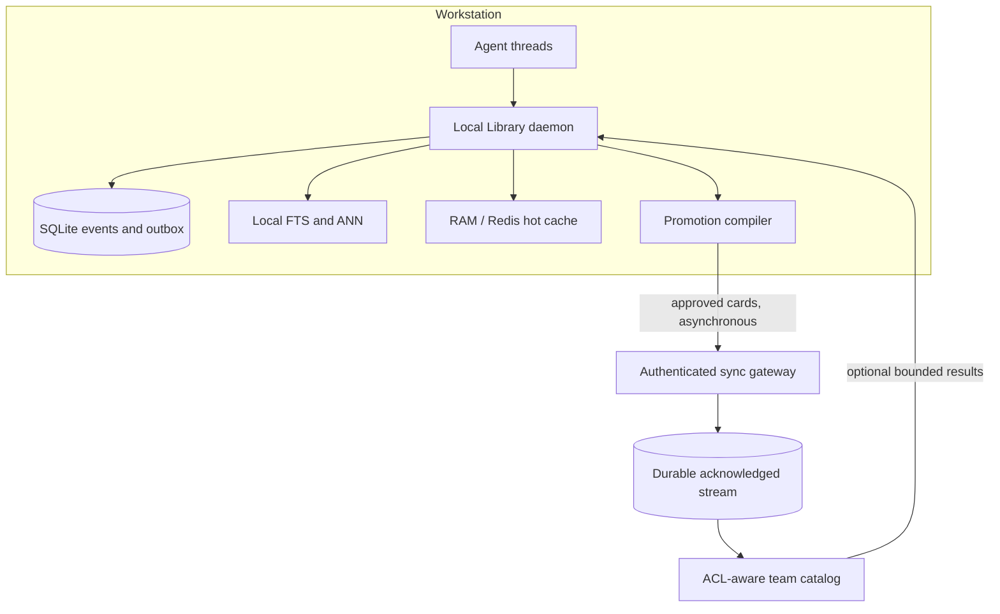

# Local-First Team Architecture

The optional team topology builds on local agent threads. Team scaling must not make a
remote service a dependency of every prompt.

> [!NOTE]
> Team synchronization, shared authorization, promotion workflows, and brokers are
> design-only. See [Capability Status](STATUS.md) for implemented behavior.

The team plane is conditional, not the destination of every installation. A solo user
should not need identity infrastructure or a broker. See
[Why These Improvements?](WHY_THE_ROADMAP.md) for the decision triggers and skeptical
case for each major subsystem.

## Scope hierarchy

```text
private thread -> personal reusable knowledge -> project knowledge -> team catalog
```

Raw prompts, tool traces, and private working state are local by default. Promotion
is explicit and selective. Eligible promotion content includes decisions, approved
facts, runbooks, evidence, summaries, and artifact references. Credentials, raw private
conversations, and incidental chain-of-work data should not move automatically.

## Recommended topology



The local daemon owns prompt construction. Team results are an optional retrieval scope
with deadlines and circuit breakers. A disconnected node continues using recent,
private, personal, and locally replicated project context.

## Event envelope

A team-ready event needs at least:

- globally unique `event_id`;
- `device_id`, `team_id`, and `project_id`;
- `agent_id` and `thread_id`;
- monotonic per-thread sequence;
- event type and schema version;
- privacy scope and sensitivity classification;
- priority;
- payload hash or content-addressed reference;
- source revision and embedding/index version;
- causation and correlation IDs;
- creation time and provenance.

Events should be immutable. Corrections use `supersedes`; deletions use authenticated
tombstones. CRDTs may suit mergeable tag or pin sets, but should not be applied to every
context payload by default.

## Broker choices

Raw Redis Pub/Sub is a useful low-latency wake-up hint but has no durable replay,
acknowledgement, consumer lag, or offline recovery. Local Redis is a disposable LFU
cache with persistence disabled, so it must not own team events.

Redis Streams can provide consumer groups, pending entries, acknowledgement, and replay
when deployed as a separate durable service. NATS JetStream and other durable brokers
are valid alternatives. In every case:

- append locally and transactionally before publishing;
- transmit idempotent event IDs;
- acknowledge only after durable apply;
- resume from durable cursors;
- reclaim abandoned work;
- trim only behind acknowledged watermarks;
- preserve the SQLite outbox/inbox as each node's recovery truth.

### Broker adoption criteria and costs

A broker becomes useful when independently failing nodes need replay, several consumers
need the same events, or polling load and visibility delay exceed the declared sync SLO.
It also introduces retention, poison-event handling, consumer recovery, upgrades,
backups, monitoring, and an on-call responsibility. It does not solve promotion policy,
identity, authorization, deletion, or semantic conflicts.

A small team can use authenticated batch push/pull against a durable team event table
with per-node cursors. A broker is justified only when promotion and authorization
semantics are stable and measured fan-out, event rate, or offline replay requirements
exceed that design. Redis Streams require a separate persistence-enabled service; the
disposable LFU cache is unsuitable.

## Promotion compiler

Instead of synchronizing every prompt, a promotion compiler can turn local work into a
reviewable knowledge card:

```yaml
kind: decision
title: Use canary deployment waves
statement: Production rollout begins with a 5% canary and health gate.
evidence:
  - artifact: runbook/deployment.md
confidence: high
status: approved
scope: project
supersedes: null
source_thread: local-reference
```

Promotion may be manual, policy-assisted, or approval-gated. The original raw thread can
remain local while the card exposes only the minimum useful team knowledge.

## Authorization

Authorization is part of retrieval, not a post-processing filter. Tenant, project,
principal, scope, source version, and tombstone predicates must constrain FTS/ANN
candidate generation before text hydration. Cache keys include an authorization
fingerprint, and permission revocation invalidates affected entries immediately.

“Immediately” applies to connected nodes with current policy. A disconnected node
cannot learn about a revocation. A deployment must choose short-lived signed
authorization leases that fail closed after expiry, or document a maximum revocation
lag and its bounded risk. Indefinite offline access and immediate revocation cannot both
be promised.

A shared deployment requires:

- device and user identity;
- per-project roles and policy;
- TLS or mTLS in transit;
- secure local key storage;
- encryption and key rotation at rest;
- provenance and audit records;
- deletion, retention, export, and legal-hold behavior;
- privacy classification before promotion.

## Ordering and conflicts

Preserve order only inside `(project_id, thread_id)` partitions. Global order is both
expensive and unnecessary. Stable event IDs make duplicate delivery safe. Each node
tracks recorded, indexed, and team-synced watermarks.

One monotonic per-thread sequence also implies one active sequence owner. Two offline
devices cannot allocate the same global sequence safely without a lease. A single-writer
design uses a thread lease; a multi-writer design requires device-local sequences,
causal metadata, and explicit conflict ordering.

Thread branches can reference `parent_thread_id` plus a parent sequence or context
snapshot. Merging should promote explicit decisions or cards rather than concatenate
two raw transcripts.

## Options and trade-offs

| Option | Choose when | Avoid when | Main cost |
|---|---|---|---|
| Embedded local process | One process or small solo workload meets its SLOs | Several agents duplicate workers and memory | Limited cross-process coordination |
| Local daemon + rings/outbox | Workstation contention or shared quotas are measured | One embedded process is sufficient | Supervision, IPC, and local SPOF |
| Federated peer nodes | Organizational constraints prohibit a shared catalog | The team cannot own discovery, conflict, and revocation complexity | Highest distributed-systems burden |
| Local nodes + shared control plane | Several principals need policy, audit, and promoted search | Manual or one-database sync meets the need | Service cost, privacy expansion, operations |
| Cloud-central prompt memory | Only when offline/local independence is not required | For the Library's primary local-first promise | Network dependency and centralized raw context |

The recommended distributed-team topology uses local nodes plus an optional shared
control plane. Remote services are outside prompt construction. For a trusted small
team, reviewed cards and a durable sync API provide the simplest starting point. A cloud
or broker layer is justified only when measured fan-out, replay, or coordination
requirements exceed the local design.

## Open design questions

- What approval experience makes promotion useful without becoming burdensome?
- Which data must never leave a workstation?
- Should project catalogs replicate locally or be queried remotely with deadlines?
- Which broker offers the best self-hosted operational profile for small teams?
- How should a node prove deletion and permission revocation while offline?
- What does a useful context-branch merge look like in agent developer tools?
- How can a team evaluate retrieval usefulness without collecting raw private prompts?
- What quotas prevent one agent or project from monopolizing disk, RAM, or promotion
  throughput?
