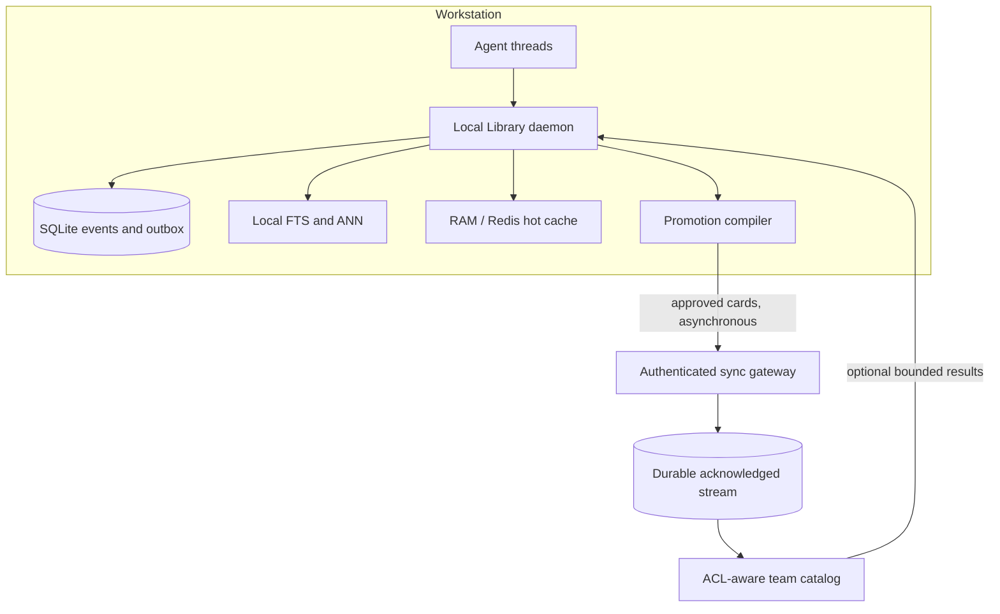

# Local-First Team Architecture

The Library is designed first for local agent threads. Team scale should extend that
model without turning a remote service into a dependency of every prompt.

## Scope hierarchy

```text
private thread -> personal reusable knowledge -> project knowledge -> team catalog
```

Raw prompts, tool traces, and private working state remain local by default. Promotion
is explicit and selective. Good promotion candidates include decisions, approved facts,
runbooks, evidence, summaries, and artifact references. Credentials, raw private
conversations, and incidental chain-of-work data should not move automatically.

## Recommended topology



The local daemon owns prompt construction. Team results are an optional retrieval scope
with deadlines and circuit breakers. A disconnected node continues using recent,
private, personal, and locally replicated project context.

## Event envelope

A team-ready event needs at least:

- globally unique `event_id`;
- `device_id`, `team_id`, and `project_id`;
- `agent_id` and `thread_id`;
- monotonic per-thread sequence;
- event type and schema version;
- privacy scope and sensitivity classification;
- priority;
- payload hash or content-addressed reference;
- source revision and embedding/index version;
- causation and correlation IDs;
- creation time and provenance.

Events should be immutable. Corrections use `supersedes`; deletions use authenticated
tombstones. CRDTs may suit mergeable tag or pin sets, but should not be applied to every
context payload by default.

## Broker choices

Raw Redis Pub/Sub is a useful low-latency wake-up hint but has no durable replay,
acknowledgement, consumer lag, or offline recovery. The current local Redis instance is
configured as a disposable LFU cache with persistence disabled, so it must not own team
events.

Redis Streams can provide consumer groups, pending entries, acknowledgement, and replay
when deployed as a separate durable service. NATS JetStream and other durable brokers
are valid alternatives. In every case:

- append locally and transactionally before publishing;
- transmit idempotent event IDs;
- acknowledge only after durable apply;
- resume from durable cursors;
- reclaim abandoned work;
- trim only behind acknowledged watermarks;
- preserve the SQLite outbox/inbox as each node's recovery truth.

## Promotion compiler

Instead of synchronizing every prompt, a promotion compiler can turn local work into a
reviewable knowledge card:

```yaml
kind: decision
title: Use canary deployment waves
statement: Production rollout begins with a 5% canary and health gate.
evidence:
  - artifact: runbook/deployment.md
confidence: high
status: approved
scope: project
supersedes: null
source_thread: local-reference
```

Promotion may be manual, policy-assisted, or approval-gated. The original raw thread can
remain local while the card exposes only the minimum useful team knowledge.

## Authorization

Authorization is part of retrieval, not a post-processing filter. Tenant, project,
principal, scope, source version, and tombstone predicates must constrain FTS/ANN
candidate generation before text hydration. Cache keys include an authorization
fingerprint, and permission revocation invalidates affected entries immediately.

A shared deployment requires:

- device and user identity;
- per-project roles and policy;
- TLS or mTLS in transit;
- secure local key storage;
- encryption and key rotation at rest;
- provenance and audit records;
- deletion, retention, export, and legal-hold behavior;
- privacy classification before promotion.

## Ordering and conflicts

Preserve order only inside `(project_id, thread_id)` partitions. Global order is both
expensive and unnecessary. Stable event IDs make duplicate delivery safe. Each node
tracks recorded, indexed, and team-synced watermarks.

Thread branches can reference `parent_thread_id` plus a parent sequence or context
snapshot. Merging should promote explicit decisions or cards rather than concatenate
two raw transcripts.

## Options and trade-offs

| Option | Offline | Privacy | Team scale | Complexity | Recommended use |
|---|---:|---:|---:|---:|---|
| Enhanced local process | High | High | Low | Low | Solo prototype |
| Local daemon + rings/outbox | High | High | Medium | Medium | Next implementation stage |
| Federated peer nodes | High | Medium-high | Medium-high | Very high | Privacy-constrained small teams |
| Local nodes + shared control plane | High | Medium-high | High | High | Recommended team evolution |
| Cloud-central prompt memory | Low | Low-medium | High | Medium | Not recommended as primary path |

## Open collaboration questions

- What approval experience makes promotion useful without becoming burdensome?
- Which data must never leave a workstation?
- Should project catalogs replicate locally or be queried remotely with deadlines?
- Which broker offers the best self-hosted operational profile for small teams?
- How should a node prove deletion and permission revocation while offline?
- What does a useful context-branch merge look like in agent developer tools?
- How can a team evaluate retrieval usefulness without collecting raw private prompts?
- What quotas prevent one agent or project from monopolizing disk, RAM, or promotion
  throughput?
