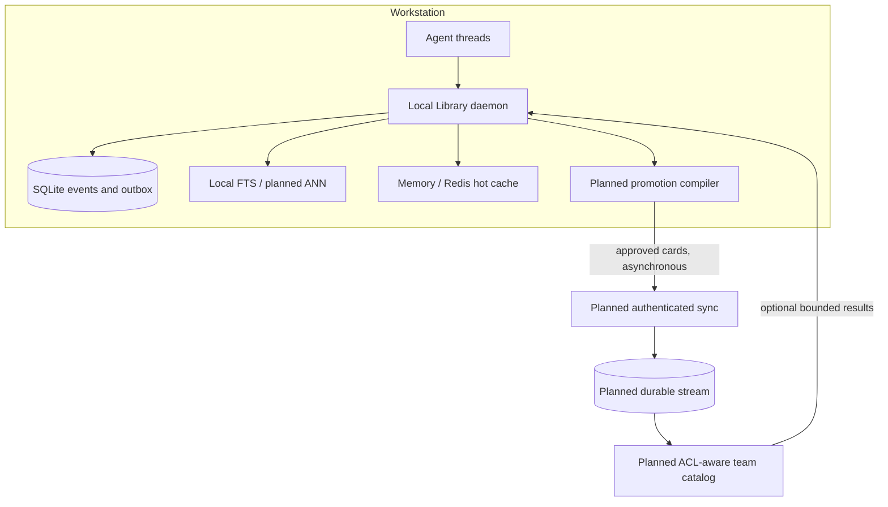

# Local-First Team Architecture

A local-first system completes its essential work on one workstation. The optional team design extends local agent threads without making a remote service necessary for each prompt.

The [Glossary](GLOSSARY.md) defines shared technical terms.

SQLite is the embedded database that stores authoritative Library data in one file.

> [!NOTE]
> The Library implements copy-based promotion and trusted scope routing for threads, projects, and teams.
>
> The Library does not implement authenticated membership, promotion review, cross-workstation synchronization, shared authorization, or a team message broker.
>
> [Capability Status](STATUS.md) defines this boundary.

The team plane is optional. A solo user does not need identity services or a message broker.

A message broker stores and delivers messages between independent components. [Why These Improvements?](WHY_THE_ROADMAP.md) defines adoption conditions for major team components.

## Scope hierarchy

```text
implemented: private thread -> project knowledge -> team catalog
planned:     private thread -> personal reusable knowledge -> project knowledge -> team catalog
```

Raw prompts, tool traces, and private working state remain local by default. The implementation provides explicit copying between trusted thread, project, and team scopes.

The team design includes a planned personal scope and planned branch-aware routing. Branch-aware routing preserves relationships between related chat branches.

Suitable promotion content includes approved facts, decisions, operating procedures, evidence, summaries, and artifact references.

The system must not promote credentials, raw private conversations, or incidental work data automatically.

## Recommended topology

The diagram shows the conditional team design. The local implementation contains these components:

- a local daemon, which is a background process that serves several clients
- a SQLite database for events and an outbox of pending work
- full-text search (FTS), which finds records that contain matching terms
- random-access memory and an optional Redis key-value cache

The team design specifies these planned components:

- approximate nearest-neighbor (ANN) vector search, which searches likely vector matches
- a promotion compiler, which converts selected local work into reviewable team records
- authenticated synchronization between workstations
- a durable team event stream
- a catalog that enforces access-control lists

An access-control list (ACL) defines which identities can access each resource.

An outbox is a durable table of work that another component must deliver. Asynchronous delivery can finish after local storage returns.



The local daemon owns prompt construction. Team results form an optional retrieval scope with deadlines and failure isolation.

A circuit breaker provides failure isolation. It stops repeated calls to a failing service for a limited time.

A disconnected node continues with recent context, private thread records, and replicated project records. A personal reusable scope requires the planned identity and routing contract.

## Event envelope

An event envelope carries a team event and the data required to route, verify, and process it.

A team event needs at least:

- a globally unique `event_id`
- `device_id`, `team_id`, and `project_id`
- `agent_id` and `thread_id`
- an increasing sequence for each thread
- an event type and schema version
- a privacy scope and sensitivity class
- a priority
- a payload hash or content-addressed reference
- a source revision and embedding or index version
- causation and correlation identifiers
- creation time and provenance

A payload hash is a value calculated from the content. A content-addressed reference locates content by that calculated value.

A causation identifier names the event that caused another event. A correlation identifier groups events from one operation or workflow.

Events should be immutable. Immutable events do not change after storage.

A correction identifies the replaced event with `supersedes`. A deletion uses an authenticated tombstone. A tombstone is a durable record that marks data as deleted.

A conflict-free replicated data type can merge some changes without one global writer. It can suit tag or pin sets.

Do not apply this data type to every context record. Complex payloads still need explicit conflict rules.

## Broker choices

Redis publish-and-subscribe messaging can provide a low-delay wake-up hint. It sends each message to listening consumers.

This mechanism does not provide durable replay, acknowledgment, consumer lag tracking, or offline recovery.

The local Redis cache disables persistence and uses least-frequently-used eviction. Therefore, it must not own team events.

Redis Streams can provide consumer groups, pending entries, acknowledgment, and replay. It must run as a separate durable service.

A consumer group divides stream work among consumers. NATS JetStream and other durable brokers are also possible choices.

A watermark identifies the highest sequence that a processing stage completed without a gap. Every broker design must follow these rules:

- Store an event in the local outbox before publication.
- Use stable event identifiers so repeated delivery has one effect.
- Acknowledge an event only after durable application.
- Resume from durable cursors. A cursor records the last processed stream position.
- Reclaim work from consumers that stop.
- Remove old stream entries only behind acknowledged watermarks.
- Keep SQLite outbox and inbox tables as the local recovery source.

### Broker adoption criteria and costs

A broker becomes useful when independent nodes need replay. It can also serve several consumers that need the same events.

Adopt a broker when polling cost or synchronization delay exceeds the declared service-level objective. A service-level objective is a measurable operational target.

A broker adds retention policy, failed-event handling, recovery, upgrades, backups, monitoring, and operator responsibility.

It does not define promotion policy, identity, authorization, deletion, or conflict resolution.

A small team can use authenticated batch transfer with a durable team event table. Each node stores a cursor.

Adopt a broker only after promotion and authorization rules are stable. Measured delivery rate, fan-out, or offline replay needs must exceed the batch design.

Fan-out is the number of consumers that receive each event. The disposable Redis cache cannot serve as the durable Redis Streams service.

## Promotion compiler

A promotion compiler converts selected local work into a reviewable knowledge card. A knowledge card is a concise, structured team record with evidence and provenance.

```yaml
kind: decision
title: Use canary deployment waves
statement: Production rollout begins with a 5% canary and health gate.
evidence:
  - artifact: runbook/deployment.md
confidence: high
status: approved
scope: project
supersedes: null
source_thread: local-reference
```

Promotion can be manual, policy-assisted, or approval-gated. The raw thread can remain local. The card exposes only the information that the team needs.

## Authorization

Authorization controls which actions and records an identity can access. Retrieval must enforce authorization during candidate selection, not after text loading.

Tenant, project, user, scope, source version, and tombstone filters must constrain FTS and ANN candidates.

A tenant is an isolated organization or account. A principal is an authenticated user, device, or service.

Cache keys must include an authorization fingerprint. This fingerprint is a stable value that represents effective permissions.

Permission changes must invalidate affected cache entries on connected nodes. Invalidation marks cached data as unusable.

A disconnected node cannot receive a revocation. A deployment must choose one of two bounded policies.

It can use short-lived signed authorization leases that deny access after expiration. It can instead document the maximum revocation delay and risk.

Immediate revocation and unlimited offline access are incompatible requirements.

A shared deployment requires:

- device and user identity
- project roles and authorization policy
- Transport Layer Security or mutual Transport Layer Security during transmission
- protected local key storage
- encryption and key rotation for stored data
- provenance and audit records
- deletion, retention, export, and legal-hold rules
- privacy classification before promotion

Mutual Transport Layer Security verifies both endpoints. A legal hold prevents deletion of specified records during a legal process.

## Ordering and conflicts

The system preserves local order only within `ThreadKey(collection, session_id)`. A team transport maps that key to stable project and thread identifiers across nodes.

The system does not need one global event order. Stable event identifiers make repeated delivery safe.

Each node tracks recorded, indexed, and team-synchronized watermarks.

One increasing thread sequence requires one active sequence owner. Two offline devices cannot safely allocate one shared sequence without a lease.

A single-writer design uses a thread lease. A multi-writer design uses device-local sequences, causal metadata, and explicit conflict ordering.

Causal metadata records which events depend on earlier events.

Thread branches can identify a parent with `parent_thread_id`. They can also record the parent sequence or a context snapshot.

A merge should promote explicit decisions or knowledge cards. It should not concatenate two raw transcripts.

## Options and trade-offs

| Option | Choose when | Avoid when | Main cost |
|---|---|---|---|
| Embedded local process | One process or a small solo workload meets its targets | Several agents duplicate workers and memory | Limited coordination between processes |
| Local daemon with rings and outbox | Measured workstation contention or shared quotas require one owner | One embedded process is sufficient | Supervision, communication, and one local failure point |
| Federated peer nodes | Organizational rules prohibit a shared catalog | The team cannot operate discovery, conflict, and revocation systems | Highest distributed-system complexity |
| Local nodes with shared control plane | Several identities need policy, audit, and promoted search | Manual transfer or one database meets the need | Service cost, privacy expansion, and operations |
| Central cloud prompt memory | Offline and local independence are not requirements | The Library must preserve its local-first contract | Network dependency and centralized raw context |

A control plane manages shared identity, policy, and coordination. It does not need to construct each local prompt.

The conditional team design uses local nodes with an optional shared control plane. A trusted small team can start with reviewed cards and a durable synchronization interface.

Add a broker or cloud service only when measured replay, fan-out, or coordination needs exceed that interface.

## Open design questions

- Which approval process makes promotion useful without excessive work?
- Which data must never leave a workstation?
- Should workstations copy project catalogs or query them through a remote service with deadlines?
- Which broker has the lowest operating cost for a small self-hosted team?
- How can an offline node prove deletion and permission revocation?
- How should developer tools show and merge context branches?
- How can a team measure retrieval value without collecting private prompts?
- Which quotas prevent one agent or project from consuming excessive disk, memory, or promotion capacity?
