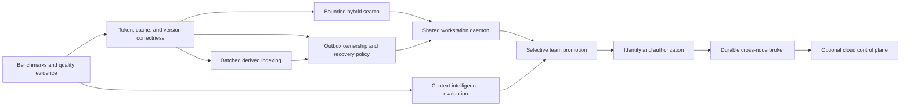

# Why These Improvements?

Each roadmap item is conditional. Adoption requires an observed problem, a measurable
criterion, comparison with simpler options, and a rollback path. The
[glossary](GLOSSARY.md) defines shared terms.

## Decision rule

Ask these questions before you add a subsystem:

1. What observed problem does it solve? Name the workload, failure, or quality error.
2. Which invariant is at risk? Relevant invariants include prompt bounds, durability,
   visibility, privacy, and local operation.
3. What is the smallest viable change? A query repair can remove the need for a
   service.
4. Which failures does it introduce? Each cache, worker, broker, summary, or service can
   become stale or unavailable.
5. Which criterion defines success? Performance work needs retrieval-quality evidence.
6. Can operators disable or reverse it? Optional components must not own the only
   context copy.

Use this default sequence:

```text
measure -> repair correctness -> remove unnecessary work -> add bounded concurrency
        -> add local scale machinery -> add team machinery only for a team need
```

## Recommendation classes

| Class | Meaning | Examples |
|---|---|---|
| Correctness | Required when the affected path operates | Complete cache identity and authorization before shared retrieval |
| Evidence | Required before scale or quality claims | Benchmarks, retrieval tests, queue metrics, and recovery metrics |
| Scale-triggered | Added after a measured local limit | Approximate search and a workstation daemon |
| Optional accelerator | Useful in some environments and never authoritative | Local Redis and pooled connections |
| Team-only | Excluded from the minimum solo installation | Identity, team broker, and promotion workflow |
| Research | Evaluated before default use | Automatic protection, state capsules, and branch merging |

Approximate nearest neighbor (ANN) search provides bounded vector candidates. Full-text
search (FTS) provides lexical candidates. A service-level objective (SLO) is a
measurable operating target.

Interprocess communication (IPC) carries messages between local processes. A recovery
point objective (RPO) limits allowed committed-data loss. A recovery time objective
(RTO) limits recovery duration.

## Summary decisions

| Subsystem or policy | Purpose | Main cost or risk | Trigger |
|---|---|---|---|
| Reproducible benchmarks | Test performance and quality claims | Test data can be expensive or unrepresentative | Before an architecture threshold or performance claim |
| Model-aware tokenization | Enforce the selected model limit | Provider and version coupling | Estimator failures or a known production model |
| Complete cache identity | Prevent stale or unauthorized hits | Lower cache reuse and migration work | Before configurable ranking or multiple index versions |
| Bounded hybrid search | Bound cold retrieval work | Approximation and index lifecycle | Exact search exceeds a latency or memory SLO |
| Batched indexing | Separate append latency from embedding work | Lag, retry, ordering, and backpressure | Embedding work exceeds append or visibility SLOs |
| Outbox claims | Control duplicate work and repeated failures | Leases, quarantine, and operator action | Multiple workers or external embedders |
| Atomic source editions | Prevent partial document visibility | Temporary storage and cleanup | Queries overlap source replacement |
| Diversity controls | Increase distinct evidence | Loss of useful repetition or adjacent context | Measured repetition harms evidence coverage |
| Workstation daemon | Share local workers and caches | Supervision, IPC, and one failure boundary | Local processes duplicate material work |
| Fixed workers | Bound concurrency | Rejection and capacity policy | Concurrent load causes unbounded threads or delay |
| Local metrics | Measure delay, lag, saturation, and recovery | Resource cost and label privacy | Required for each declared SLO path |
| Context capsules | Surface objectives and decisions | Omission, distortion, and stale instructions | Controlled tests show better continuity than raw retrieval |
| Automatic protection | Keep critical state in prompts | Stale state can displace current evidence | Explainable policy outperforms explicit protection |
| Branch routing | Represent forks and scope choices | Complex merge and precedence rules | A host exposes forks or additional scopes |
| Lifecycle adapters | Apply governor behavior to model calls | Provider changes and retry complexity | A host provides stable request and response hooks |
| Local Redis | Cache local hot data | Service cost, eviction, and cold restarts | Measured reuse justifies operation |
| Stronger durability | Reduce machine-loss exposure | Write delay and backup policy | Declared recovery point objective permits less data loss than the baseline profile |
| Team promotion | Share selected durable knowledge | Approval, origin, conflict, and privacy work | Approved knowledge must cross workstations |
| Authorized retrieval | Prevent cross-project disclosure | Identity, policy, filtering, and invalidation | Before any mixed-trust catalog |
| Durable broker | Replay changes across nodes | Distributed operations | Independent nodes need offline recovery |
| Cloud control plane | Coordinate remote teams | Cost, privacy, outages, and critical-path risk | A remote team needs shared coordination |

## 1. Measure retrieval and context quality first

### Reason

The system balances latency, memory, recall, freshness, and privacy. A change can improve
one measure and damage another. Exact vector scoring provides a deterministic quality
reference.

### Limits

An extensive test platform can cost more than the local implementation. Synthetic data
can reward the wrong query pattern. Metric labels can expose private text.

Start with repeatable commands, fixed public or synthetic data, machine-readable
results, and low-cardinality metrics. Expand coverage only for a specific decision.

### Adopt when

Require benchmark coverage before ranking, candidate, token, queue, durability, or
scale changes. Report hardware, data, selectivity, concurrency, cache state, quality,
and latency.

## 2. Use model-aware tokenization through adapters

### Reason

The four-characters-per-token estimate is portable but approximate. Code, non-Latin
text, long strings, and tool data can exceed an intended prompt limit.

### Limits

Tokenization changes by model and version. One required provider library would increase
offline dependencies. Stored token counts can become stale after a tokenizer change.

### Decision

Keep the conservative estimator as the fallback. Add caller-selected tokenizer
adapters. Store tokenizer identity with derived counts. Keep a final admission check.

Adopt an exact adapter for a known model. Also adopt one when difficult tests show a
fallback failure.

## 3. Complete cache and source identity

### Reason

A cache hit is valid for one ranking, embedding, tokenizer, authorization, and index
configuration. Missing identity data can return stale or unauthorized results. Atomic
source identity prevents partial document replacement.

### Limits

Overly broad keys reduce reuse and increase storage. Versioned publication temporarily
stores two editions. It also needs safe cleanup.

### Decision

Define one retrieval-configuration digest and one index-snapshot identifier. Include
only values that affect ranking, visibility, or authorization. Treat a configuration
change as a cache miss.

Use immutable source editions when concurrent replacement becomes a measured workload.
Change the active-edition pointer atomically.

## 4. Add bounded hybrid search for large catalogs

### Reason

Novel exact-vector queries score each live record. Time and temporary memory increase
with catalog size. A bounded pipeline combines authorized lexical and vector candidates
before exact reranking.

SQLite FTS can inspect a selectivity-dependent posting list. Bounded returned candidates
do not prove constant internal work. Measure query plans, updates, deletes, and source
replacement.

### Limits

ANN search trades recall for speed. It adds build, migration, memory, recovery, and
platform work. Exact scoring can remain faster for a small catalog.

### Alternatives

- Keep exact scoring below a measured threshold.
- Apply metadata or FTS filters before exact scoring.
- Store vectors contiguously to reduce object overhead.
- Put an ANN implementation behind a local adapter.

### Adopt when

Use the smallest option that meets cold-query latency, memory, and quality targets. An
ANN report must compare recall and answer quality with exact scoring.

The report must include recovery, build time, disk use, memory use, and platform
support.

### Diversity is a separate decision

Repeated chunks can consume the desk budget. Hash deduplication, adjacent-chunk merging,
source limits, or diversity ranking can increase evidence coverage. These controls can
also remove useful support.

Measure repeated-token rate, source concentration, evidence coverage, and answer
grounding. Never remove protected or pinned records through a diversity rule. Consider
deterministic ingestion deduplication first.

## 5. Batch derived indexing and preserve immediate visibility

### Reason

Synchronous embedding makes append latency depend on document size and service round
trips. Token-based batches reduce those trips. Asynchronous indexing keeps durable
append work short.

The recent-event layer exposes an event before embedding. The durable outbox preserves
pending work through restart.

### Limits

Asynchronous work introduces lag, duplicates, retries, shutdown rules, and watermark
waits. Large batches can delay interactive work.

### Decision

Keep event append synchronous and small. Batch derived work only. Expose recorded,
embedded, and indexed watermarks. Reserve interactive capacity. Bound retries.

Allow strict callers to wait with a deadline. Increase batches when embedding cost
dominates measured append cost.

### Durable work ownership

Claim tokens and expiring leases assign each outbox row to one worker. The indexer
claims thread heads and preserves thread order. It uses bounded retry and terminal
quarantine.

One owner does not steal an expired claim from its own worker. A replacement owner can
reclaim that claim after expiration. Live hangs require bounded backends and supervised
restart.

Measure pending age, attempts, quarantine count, continuous saturation, and recovery
drain rate. Ring occupancy alone can hide short overload.

## 6. Publish source editions atomically

### Reason

Row-by-row replacement exposes an empty or partial document. An immutable edition and
one active pointer make visibility atomic. This design also preserves clear origin.

### Limits

Versioned publication temporarily duplicates data. It needs cleanup, retention, and
tombstone rules. Rare offline ingestion may not justify this lifecycle.

### Adopt when

Use atomic editions when replacement overlaps queries. Also use them when rollback or
exact team origin matters.

## 7. Use a daemon when local processes compete

### Reason

One daemon can share connections, caches, recent state, schedulers, and fixed workers.
It also provides one place for admission, health, quotas, and recovery.

### Limits

A daemon needs installation, supervision, authentication, IPC versions, upgrades, and
recovery. It creates a workstation failure boundary. Embedded mode remains suitable for
one small process.

### Adopt when

Adopt a daemon when processes duplicate material memory or work. Also adopt it when
contention breaks a declared SLO. Keep embedded mode for tests, small tools, and
recovery.

### Resource contract

Define disposable state, idle time, byte limits, project quotas, drain deadlines, and
low-disk behavior. Preserve committed context and interactive prompts during disk
pressure. Reject or limit bulk ingestion.

Provide an explicit recovery action. Do not delete durable events automatically to
meet a quota.

## 8. Use fixed workers, ordering partitions, and backpressure

### Reason

A thread for each request turns overload into delay and memory growth. A fixed pool
bounds resources. Partitioning by project and thread preserves required order.

Admission control prevents bulk work from blocking an interactive refresh.

### Limits

Complex scheduling can starve maintenance. Rejected work needs a clear client contract.

### Decision

Start with a small fixed pool. Use one interactive lane and one bulk lane. Measure queue
age and occupancy. Keep durable overflow in the outbox.

Tag each focus result with its input generation. Discard a result after a newer focus
wins.

### Metrics and overload behavior

Measure append and prompt latency, candidates, queue age, retries, index lag, cache
behavior, memory, disk space, and recovery. Do not use private identifiers or prompt
text as metric labels.

An interactive caller can receive a bounded stale desk, deadline error, or resource
error. The service can limit bulk ingestion while durable work remains in the outbox.

Add exported tracing only for unexplained incidents or fleet correlation. Verify
bounded telemetry cost and label counts.

## 9. Treat summaries and capsules as derived indexes

### Reason

Long threads contain objectives, decisions, constraints, open work, and replaced facts.
Structured capsules can retrieve these concepts directly. Versioned summaries can help
navigation and reduce prompt use.

### Limits

A summary can omit a condition or combine incompatible states. It can preserve a
reversed decision. Generated memory can appear more authoritative than its evidence.

### Decision

Retain original events. Store summaries as versioned derived records. Link each derived
record to evidence and an input watermark. Mark stale records visibly.

Evaluate continuity, contradiction handling, and origin. Do not measure token reduction
alone. Promote derived records through an explainable rule only.

## 10. Automate protection conservatively

### Reason

Manual protection can miss an active constraint or unresolved commitment. A clear rule
can keep important state visible as the recent ring advances.

### Limits

Protected context consumes each prompt. Stale or conflicting items can displace current
evidence. Automatic release can remove a valid constraint.

### Adopt when

Start with explicit protection. Test automatic rules offline. Show the reason, evidence,
age, and release condition for each decision.

Use automatic protection by default only after it improves continuity. It must not
increase stale-instruction or contradiction failures.

## 11. Define branch and scope behavior before memory merging

### Reason

Agent work can fork. A child thread needs an exact inheritance point. Personal, project,
and team scopes need different privacy and ranking rules.

### Limits

Two branches can contain incompatible decisions. Transcript concatenation or summary
merging can hide the conflict. Generic replicated-data structures do not resolve human
semantic disagreement.

### Decision

Represent a fork with a parent thread and sequence or snapshot identifier. Merge explicit
decisions, facts, and artifacts with origin. Do not merge raw transcripts by default.

Add this behavior when a host exposes forks. Also add it when retrieval tests show scope
confusion.

## Lifecycle adapters need one intervention contract

### Reason

The governor works only when an integration sends its bounded messages. The integration
must also record user, assistant, and tool events. Retries, streaming aborts, and native
compaction can create duplicates or gaps.

### Limits

Provider interfaces change frequently. An adapter without request and response hooks
cannot enforce the lifecycle. Adapter maintenance must not displace core work.

### Adopt when

Define one conformance contract for prepare, commit, retry, abort, streaming, and tool
events. Prevent full-transcript duplicate sending. Add an adapter only for a host with
the required hooks and maintainers.

Do not claim that an MCP tool replaces undocumented host compaction.

## 12. Keep Redis optional and disposable

### Reason

Local Redis can share hot records and query results. It provides expiration and
eviction. It can reduce repeated SQLite loading across local processes.

### Limits

Redis adds a service, serialization, duplicate data, eviction, and timeout delay. Remote
Redis also adds network, credential, security, availability, and cost concerns. The
cache cannot serve as a broker or source of truth.

### Adopt when

Enable Redis when measured reuse exceeds its operating cost. Keep SQLite authoritative.
Verify that Redis loss does not stop prompt construction.

Use a separate secured service for a team deployment. Do not extend the disposable
local cache across machines.

## 13. Match durability to context value

### Reason

SQLite write-ahead logging with `synchronous=NORMAL` balances local latency and
durability. It does not prevent loss under every power or storage failure. Important
decisions can require stronger synchronization and backups.

### Limits

Stronger disk synchronization increases write latency. Backups can retain sensitive or
deleted content. They also require encryption-key management.

### Adopt when

Declare the RPO and RTO for each deployment. Offer stronger durability as a profile.
Test crash and restore behavior on the target file system.

Connect backups to retention, deletion, encryption, and low-disk rules.

## 14. Promote selected knowledge instead of complete prompts

### Reason

Teams can share decisions, approved facts, procedures, evidence, and artifacts. A
promotion process creates a reviewable knowledge card. Private thread details remain on
the workstation.

### Limits

Complete-thread synchronization increases privacy, storage, legal, and network scope.
It also increases the risk of sharing credentials or incidental tool output.

### Adopt when

Start team work when people need reusable knowledge across workstations. Define eligible
content, approval, replacement, deletion, and origin inspection. Keep local operation
independent from the team service.

## 15. Enforce authorization during candidate retrieval

### Reason

Filtering after search is too late. Unauthorized text can already enter memory, scores,
logs, or caches. Shared indexes must filter candidates before content loading.

Include tenant, project, user, scope, source version, and tombstone state in the filter.
Include an authorization fingerprint in cache identity. Revocation must clear affected
entries.

### Limits

Identity and policy code add configuration and failures to solo mode. File permissions
and local process boundaries can remain the correct minimum there.

### Adopt when

Authorization-aware retrieval is mandatory before mixed-trust data enters one service
or index. Test forbidden queries, cache reuse, revocation, replicas, logs, and derived
indexes. Require no unauthorized disclosure.

## 16. Use a durable broker across durable failure boundaries

### Reason

A durable stream supports replay, acknowledgement, ownership, lag measures, and
recovery between independent nodes. Stable identifiers and inbox or outbox records make
duplicates safe.

### Limits

One process already has a bounded work ring and SQLite outbox. A broker adds deployment
and failure work without adding a durability boundary. Redis Pub/Sub is a lossy signal
and cannot replace the outbox.

### Adopt when

Add a broker when independent nodes need offline replay and observable delivery. Choose
it through failure tests, maintenance, security, client support, and throughput.

Acknowledge an event after durable application. Retain local inbox and outbox recovery.

## 17. Keep cloud coordination outside local prompt construction

### Reason

A shared service can coordinate device identity, policy, promoted knowledge, audit, and
fleet visibility. Managed operation can help a remote team without a common local host.

### Limits

Central raw context increases privacy and compliance scope. Network outages can affect
continuity. Managed storage, search, and data transfer add continuing cost.

### Decision

Keep private events, recent state, prompt assembly, and an offline-capable index on the
workstation. Synchronize approved knowledge asynchronously. Apply deadlines and circuit
breakers to optional team retrieval.

Adopt a cloud control plane for a demonstrated remote-team need. Size cost by promoted
data instead of all prompt traffic.

## Make paging decisions visible

### Reason

Users need to know which context was protected, retrieved, omitted, truncated, stale,
or pending. This information helps diagnose apparent forgetting and stale protection.

### Limits

Detailed explanations consume attention and prompt space. Origin data can expose
sensitive project names or paths. A polished explanation can imply unsupported
certainty.

### Decision

Provide a stable machine-readable explanation and a concise summary. Offer optional
detail. Use the Library metaphor with precise technical terms. Remove sensitive origin
data at trust boundaries.

A command-line status inspector meets the minimum developer requirement. Automatic
protection, promotion, and non-developer use need this interface.

## Dependency order

Some components depend on earlier contracts:



Begin authorization design with team-promotion design. Do not deploy a team service
before security controls.

Search and concurrency work are independent. A large solo catalog can need ANN before
a daemon. Many agents with a small catalog can need shared workers before ANN.

The order is a dependency guide. It is not a universal deployment sequence.

## Policy conflicts

Some goals cannot coexist. Each deployment must select and document a policy.

### Immediate revocation and indefinite offline access

An offline node cannot receive a revocation. Use short authorization leases that fail
closed. Alternatively, define a maximum revocation delay and bounded exposure risk.

No-disclosure claims apply to connected current-policy tests. An offline node needs
expired-lease removal for the same claim.

### One monotonic thread sequence and multiple offline writers

Disconnected devices cannot allocate one collision-free sequence without prior
ownership. Use one writer lease for each thread initially.

A multi-writer design needs device sequences, causal data, and explicit conflict order.
Do not assume one global sequence.

### Unlimited protected context and a bounded prompt

Every protected item cannot remain in every bounded prompt without a limit. Set a token
or priority cap. Alternatively, page items, create a reviewable summary, or return a
visible policy error.

Do not omit protected context silently.

### Strict freshness and an unrelated global backlog

Unpartitioned old work can block a strict freshness wait. Use a deadline until claims,
partitions, and priority prevent starvation. Status must show the thread watermark and
blocking backlog.

## Default modes

Retain these modes while they meet declared workloads and SLOs:

- Python and SQLite without an external service for one local Library.
- exact vector scoring for small catalogs and quality comparison.
- explicit protection before automatic policy.
- an embedded governor for tests and small tools.
- optional Redis instead of a required dependency.
- original events as authoritative data.
- local prompt construction when team or cloud services exist.

A proposed component must solve a demonstrated problem. It must preserve applicable
default properties. Additional complexity alone is not evidence.

## Compatibility and migration

The Library versions several surfaces independently. These surfaces include SQLite,
events, embeddings, token counts, vector indexes, cache keys, daemon IPC, knowledge
cards, and synchronization messages.

Each change must state:

- whether versions can coexist.
- how data is rebuilt, migrated, or cleared.
- how an interrupted migration resumes.
- which parts can roll back.
- when old versions and caches can be removed.
- which mixed-version combinations have tests.

Derived data can be rebuilt. Authoritative event history and origin must remain
recoverable through each transition.
