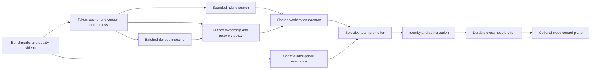

# Why These Improvements?

Each roadmap item is conditional. Adoption requires an observed workload or failure, a
measurable acceptance criterion, comparison with simpler options, and a rollback path.

## The decision rule

Before adding a subsystem, ask six questions:

1. **What observed problem are we solving?** Name the workload, failure, or quality
   error. “It may scale someday” is not enough.
2. **Which invariant is at risk?** Examples are prompt bounds, durable-before-evictable
   ordering, recent-event visibility, privacy, or local independence.
3. **What is the smallest viable change?** An index or query fix may remove the need for
   a new service.
4. **What new failure modes appear?** Every cache, worker, broker, summary, and shared
   service adds state that can become stale, unavailable, or inconsistent.
5. **How will we decide whether it worked?** Performance changes need retrieval-quality
   evidence; context-policy changes need continuity and contradiction tests.
6. **Can it be disabled or rolled back?** Optional adapters and derived indexes should
   not own the only copy of context.

The default preference is therefore:

```text
measure -> repair correctness -> remove unnecessary work -> add bounded concurrency
        -> add local scale machinery -> add team machinery only for a team need
```

## Recommendation classes

| Class | Meaning | Examples |
|---|---|---|
| Correctness | Required when the affected path is used | Complete cache identity; authorization before shared retrieval |
| Evidence | Required before making scale or quality claims | Benchmarks, retrieval evaluations, queue and recovery metrics |
| Scale-triggered | Add only after a declared local workload crosses a measured limit | Approximate nearest-neighbor search; workstation daemon |
| Optional accelerator | Useful in some environments, never authoritative | Local Redis; pooled embedding connections |
| Team-only | Has no place in the minimum solo installation | Identity, durable team broker, promotion workflow |
| Research | Requires evaluation before it becomes a default policy | Automatic protection, state capsules, branch merging |

Terms used below: **ANN** means approximate nearest-neighbor vector search; **FTS** means
full-text search; a **service-level objective (SLO)** is a measurable operating target;
**IPC** means local interprocess communication; and a **recovery point objective (RPO)**
states how much committed data a failure is allowed to lose.

## Summary decision table

| Improvement | Why consider it? | Why not adopt it automatically? | Evidence or trigger |
|---|---|---|---|
| Reproducible benchmarks | Prevent confident changes based on anecdotes | Harnesses can become expensive and unrepresentative | Before performance claims or architectural thresholds |
| Model-aware tokenization | Make the prompt bound true for the selected model | Adds provider/version coupling and dependencies | Estimator violations or production use with a known model |
| Complete cache and index identity | Prevent stale or incorrectly ranked cache hits | Longer identities reduce hit rate and require migration | Required before configurable ranking or multiple index/model versions |
| Bounded hybrid search and ANN | Make cold retrieval work independent of catalog size | ANN is approximate and adds an index lifecycle | Exact search misses the declared latency or memory SLO |
| Batched asynchronous indexing | Keep append latency independent of embedding work | Introduces lag, retry, ordering, and backpressure concerns | Sustained ingest or embedding latency breaks append/visibility SLOs |
| Outbox claims and poison-work policy | Prevent duplicate work and infinite retry loops | Adds leases, expiry, quarantine, and operator decisions | Multiple workers or external embedders consume the outbox |
| Atomic source versions | Prevent readers seeing empty or partial document editions | Temporarily uses more storage and needs garbage collection | Sources are replaced while queries are active |
| Diversity and duplicate suppression | Spend the desk budget on distinct useful evidence | Can suppress corroboration or adjacent context | Measured redundancy harms evidence coverage |
| One workstation daemon | Share caches and workers across local agents | Adds a supervised process, IPC, and a local failure boundary | Multiple agent processes duplicate memory/work or contend materially |
| Fixed workers and admission control | Bound concurrency and protect interactive work | Queues can reject work and require capacity policy | Concurrent load creates head-of-line latency or unbounded threads |
| Low-cardinality observability | Make latency, lag, saturation, and recovery falsifiable | Telemetry costs resources and can leak sensitive labels | Immediately for SLO paths; fleet export only for fleet operation |
| Context capsules and summaries | Improve navigation through long, changing work | Derived text can omit, distort, or preserve stale instructions | Evaluation shows better continuity with originals retained |
| Automatic protection policy | Keep critical state resident without manual pinning | Wrongly protected context can crowd out newer truth | Explainable policy beats explicit protection in agent-thread tests |
| Branch and scope routing | Match memory to forks, projects, and user intent | Merge and precedence semantics are difficult | The host supports forks or multiple scopes with observed confusion |
| Lifecycle adapters | Ensure real model/tool turns pass through the governor correctly | Provider churn and retry/stream semantics increase maintenance | A host exposes a documented request/response intervention point |
| Local Redis | Share hot data and housekeeping across processes | Another service, duplicated data, eviction, and failure tails | Measured cross-process cache reuse justifies its operating cost |
| Stronger SQLite durability and backups | Reduce power-loss and machine-loss exposure | Stronger sync increases write latency; backups need lifecycle policy | The deployment declares an RPO that `NORMAL` WAL cannot meet |
| Selective team promotion | Share durable decisions without sharing every prompt | Approval, provenance, conflict, and privacy work | A team has reusable knowledge that must cross workstations |
| Authorization-aware retrieval | Prevent cross-project disclosure | Adds identity, policy, index filtering, and cache invalidation | Mandatory before any mixed-trust or multi-user catalog |
| Durable team broker | Replay and acknowledge cross-node changes | Distributed operations are unnecessary for one machine | More than one node needs offline recovery and observable delivery |
| Optional cloud control plane | Coordinate identity, policy, and promoted knowledge | Cost, privacy expansion, outages, and accidental critical-path coupling | Remote teams need shared coordination that a LAN host cannot provide |

## 1. Measure retrieval and context quality first

### Why

The system has several competing outcomes: low latency, bounded memory, useful recall,
fresh context, and no unauthorized disclosure. Improving one can damage another. For
example, an approximate index may make retrieval faster while omitting the decision the
agent needed. A benchmark and evaluation set makes that trade-off visible.

Measurements show when the current implementation no longer meets its declared target.
Exact vector scoring is deterministic and provides a retrieval-quality reference. Keep
it while it meets the declared latency and memory targets.

### Why not build an enormous benchmark platform now

A synthetic corpus can reward the wrong query distribution, and an extensive harness
can cost more to maintain than the alpha implementation. Metrics can also leak prompt
content if labels contain user or project text.

Start with repeatable command-line workloads, machine-readable results, fixed public or
synthetic corpora, and low-cardinality metrics. Expand the harness only when a decision
needs additional evidence.

### Adopt when

Benchmark coverage is required before changing ranking, candidate generation, token
packing, queue topology, durability policy, or production-scale claims. Report the
hardware, corpus, query selectivity, concurrency, cache state, and retrieval quality
alongside latency.

## 2. Use model-aware tokenization without making the core provider-specific

### Why

The current four-characters-per-token estimate is portable but approximate. Code,
non-Latin text, long unbroken strings, tool payloads, and different model tokenizers can
violate the intended prompt bound. A context governor that occasionally exceeds its
budget is not enforcing its most important contract.

### Why not require one tokenizer

Tokenization varies by model and version. Requiring a provider library would increase
the core dependency surface, complicate offline installation, and still be wrong for a
different model. Persisted token counts can also become stale after a tokenizer change.

### Preferred decision

Keep the conservative estimator as the dependency-free fallback. Add tokenizer
adapters selected by the caller, record the tokenizer identity with derived counts, and
always retain a final hard admission check. Adopt an exact adapter when the target model
is known or adversarial tests show that the fallback is insufficient.

## 3. Make cache and source identity complete

### Why

A cached result is correct only for the ranking configuration, embedding model and
revision, tokenizer/ranker version, authorization scope, and index snapshot that
created it. Omitting any of these can return a valid-looking but wrong or unauthorized
result. Atomic source versions similarly prevent a query from observing a document
halfway through replacement.

### Why not put every runtime value in every key

Overly broad keys destroy reuse, increase storage, and make cache behavior difficult to
understand. Versioned source publication also keeps two editions temporarily and needs
safe cleanup.

### Preferred decision

Define one canonical retrieval-configuration digest and one index snapshot identifier.
Include only values that can change ranking, visibility, or authorization. Treat cache
misses after a configuration change as the cost of correctness. Use immutable source
editions and advance an active-edition pointer atomically when concurrent replacement
becomes a real workload.

## 4. Add bounded hybrid search before claiming large-catalog scale

### Why

The current lexical candidate path is bounded, but a novel vector query still loads and
scores every live record in a namespace. Its time and transient memory therefore grow
with the catalog. A bounded hybrid pipeline can union lexical and vector candidates,
then exactly rerank only tens or hundreds of authorized records.

Approximate nearest-neighbor (ANN) indexes are one way to generate vector candidates in
sublinear work. They become important when a local catalog grows beyond the latency or
resident-memory target.

“Bounded FTS” needs a qualification: the number of returned candidates and downstream
record hydrations can be bounded, while SQLite FTS may still inspect a selectivity-
dependent posting list internally. The current read-path fix also does not prove that
FTS update and delete maintenance is constant-time. Query-plan and source-replacement
measurements remain part of the evidence gate.

### Why not use ANN everywhere

ANN trades perfect recall for speed, adds build and migration work, consumes index
memory, and introduces another derived structure to recover after failure. For a small
catalog, exact scoring may be faster overall and is easier to debug. Choosing an ANN
library too early can also couple the core to a platform-specific dependency.

### Alternatives

- Keep exact scoring below a measured size threshold.
- Use FTS or metadata to prefilter, then exact-score the smaller set.
- Store vectors in contiguous arrays to reduce Python-object overhead.
- Use a local ANN adapter behind an interface when prefiltering is insufficient.

### Adopt when

Use the smallest approach that meets a declared cold-query p95, peak-memory bound, and
quality target. An ANN backend must report recall and answer-quality deltas against the
exact scorer, recovery behavior, build time, disk/RAM cost, and platform support.

### Diversity and duplicate suppression are a separate decision

Bounded candidates can still fill the reading desk with overlapping chunks from one
source. Content-hash deduplication, adjacent-chunk merging, per-source caps, or maximal
marginal relevance can increase evidence coverage. They can also remove useful
corroboration or the surrounding passage that makes a fact understandable.

Do not add diversity because it is a standard RAG feature. Measure redundant-token
rate, source concentration, evidence coverage, and answer grounding first. Protected
and pinned records must never disappear through a diversity heuristic, and deterministic
ingest-time deduplication should be considered before query-time algorithms.

## 5. Batch indexing, but preserve immediate visibility

### Why

Embedding each chunk synchronously makes append latency proportional to document size
and embedding-service round trips. Batching by total tokens and processing derived
indexes asynchronously improves throughput and keeps the durable append path short.
The current event/outbox and recent-overlay design provides the necessary foundation:
the event is visible before its embedding is ready, and pending work survives restart.

### Why not make everything asynchronous

Asynchrony introduces queue lag, duplicate delivery, retry policy, shutdown behavior,
and the possibility that a strict query asks for an index watermark that has not been
reached. Large batches improve throughput but can delay interactive work.

### Preferred decision

Keep the event append synchronous and small. Batch only derived work. Expose recorded,
embedded, and indexed watermarks; reserve interactive capacity; bound retries; and let
strict callers wait with a deadline. Adopt larger batches when measured embedding or
ingest cost, rather than SQLite append cost, dominates the workload.

### Work ownership is a prerequisite for multiple workers

The outbox makes pending work durable, but durability is not ownership. Once several
workers or governors consume it, rows need an atomic claim or lease, lease expiry and
reclaim, retry classification, exponential jitter, and an operator-visible quarantine
for poison events. Stable event identifiers make duplicate delivery safe; they do not
make duplicate embedding and cache invalidation free.

Do not add a complex dead-letter workflow to a single deterministic hashing worker.
Add claim semantics before multi-worker daemonization or paid/external embedding, where
duplicate cost and infinite retries are operationally meaningful. Track oldest pending
age, attempt count, spill count, maximum continuous saturation, and recovery drain rate;
ring occupancy alone can hide short but severe overload.

## 6. Publish source editions atomically

### Why

Deleting an old document and inserting its new chunks one by one allows readers to see
an empty or partial edition. Building a new immutable edition and switching one active
pointer makes visibility atomic and keeps provenance clear.

### Why not do it for every tiny update

Versioned publication temporarily duplicates data and requires cleanup, retention, and
tombstone policy. For a single-user library with rare offline ingestion, this may not
justify immediate complexity.

### Adopt when

Use atomic editions when documents are refreshed while agents are querying them, when
rollback matters, or when team provenance requires an exact published version.

## 7. Consolidate into a workstation daemon only when processes compete

### Why

One daemon can share SQLite connections, caches, recent state, schedulers, and fixed
worker pools across many local agents. It prevents every MCP process from reserving its
own large cache and starting its own polling or indexing threads. It also gives one
place for admission control, health reporting, quotas, and graceful recovery.

### Why not make it the minimum installation

A daemon needs installation, startup supervision, local authentication, IPC versioning,
upgrade behavior, and failure recovery. It becomes a workstation-level failure
boundary. A library embedded in one process is simpler, easier to debug, and entirely
adequate for a solo agent with a small catalog.

### Adopt when

Move to a daemon when multiple agent processes materially duplicate memory or indexing
work, contention breaks the declared workload SLO, or workstation-wide quotas and
health are needed. Keep an embedded mode for tests, small tools, and recovery.

### Resource policy is part of the daemon, not housekeeping for later

A long-running service must define which desks and sessions are disposable, their idle
time and byte limits, per-project quotas, graceful-drain deadlines, and low-disk
behavior. Reporting limits before enforcing them is a reasonable first step. Under disk
pressure, the service should preserve committed context and interactive prompt
construction, reject or throttle bulk ingest, and provide an explicit remediation path.
Automatic deletion of durable events is not an acceptable quota mechanism.

## 8. Use fixed workers, ordering partitions, and backpressure

### Why

Thread-per-request or thread-per-session designs turn overload into latency, memory
growth, and a thundering herd. A fixed pool makes resource use bounded. Partitioning by
`(project_id, thread_id)` preserves the order that matters while allowing independent
threads to proceed concurrently. Admission control prevents bulk ingest from starving
an interactive context refresh.

### Why not add many priority queues immediately

Scheduling policy can be harder to reason about than the work itself. Too many lanes
can starve background maintenance, and rejected work requires a clear client contract.

### Preferred decision

Start with a small fixed pool, one interactive lane and one bulk lane, queue-age and
occupancy metrics, and durable overflow through the outbox. Add more policy only from
observed contention. Stale focus results must carry an input generation and be discarded
if a newer focus has won.

### Observability and overload contract

Low-cardinality counters and histograms are evidence infrastructure, not a cloud
telemetry mandate. Measure append and prompt latency, retrieval candidate counts, queue
age and occupancy, outbox retries, index lag, cache behavior, process memory, disk free
space, and recovery time. Never use raw prompts, session IDs, record IDs, or project
names as metric labels.

The system also needs declared overload behavior. Interactive callers may receive a
bounded stale desk, a deadline error, or a resource-exhausted response; bulk ingest can
be throttled while its durable work remains in the outbox. Add exported tracing only
when local metrics cannot explain incidents or a fleet needs correlation. Verify that
telemetry overhead and label cardinality remain bounded.

## 9. Treat summaries and state capsules as derived indexes, not truth

### Why

Long agent threads contain decisions, constraints, objectives, unresolved work, and
superseded facts. Structured state capsules can retrieve these concepts more directly
than raw similarity search. Versioned summaries can provide useful navigation and
reduce prompt cost.

### Why not replace originals with summaries

A summary can omit a qualification, merge incompatible states, or preserve a decision
that was later reversed. Automatically generated “memory” may sound authoritative even
when its evidence is weak. This recreates the main failure of irreversible compaction.

### Preferred decision

Retain original events, store capsules and summaries as versioned derived records, link
them to evidence and an input watermark, and visibly mark staleness. Evaluate
continuity, contradiction handling, and provenance—not just token reduction. Promote a
derived item to protected status only through an explainable policy.

## 10. Automate protection conservatively

### Why

Users should not have to manually protect every durable instruction, active constraint,
or unresolved commitment. An explainable classifier or rule set could keep important
state resident as the recent ring advances.

### Why not protect aggressively

Protected context consumes a fixed part of every prompt. Stale or conflicting protected
items can crowd out current evidence and repeatedly bias the agent. Automatic release
can be just as dangerous if it removes a still-valid constraint.

### Adopt when

Begin with explicit protection. Test candidate policies offline and show, for each
decision, the reason, evidence, age, and release condition. Automatic policy becomes a
default only if it improves continuity without increasing stale-instruction or
contradiction failures.

## 11. Add branch and scope semantics before concatenating memories

### Why

Agent work naturally forks. A child thread needs a precise inheritance point, while
personal, project, and team scopes need different privacy and ranking rules. Explicit
snapshots and scope routing are safer than copying an entire current prompt or searching
every catalog indiscriminately.

### Why not infer merges automatically

Two branches may contain mutually exclusive decisions. Concatenating transcripts or
merging summaries can hide that conflict. General conflict-free replicated data types
do not solve semantic disagreement between human decisions.

### Preferred decision

Represent a fork as a parent thread plus sequence or context-snapshot identifier. Merge
explicit decisions, facts, and artifacts with provenance; do not merge raw transcripts
by default. Add this machinery when an integration actually exposes branch/fork
operations or scope confusion appears in retrieval evaluations.

## Lifecycle adapters need a common intervention contract

### Why

The governor bounds context only if the integration records the user turn, sends exactly
the returned bounded messages, and commits assistant and tool results. Streaming aborts,
tool-call/result pairs, provider retries, concurrent calls, and native provider
compaction can otherwise create missing or duplicate events.

### Why not build an adapter for every framework

Framework and provider APIs change quickly. An adapter without a documented pre-request
and post-response hook may be cooperative rather than enforceable, and maintenance can
consume the project without improving the core.

### Adopt when

Define one conformance contract for idempotent prepare/commit, retry, abort, streaming,
tool events, and prevention of full-transcript double-send. Implement an adapter when a
host exposes the required hook and has maintainers and users. Do not claim that an MCP
tool replaces an undocumented internal compaction mechanism.

## 12. Keep Redis optional and disposable

### Why

Local Redis can share hot records and query results across processes, provide time-to-
live and least-frequently-used eviction, and reduce repeated SQLite hydration. It is a
useful accelerator when several local agents reuse the same working set.

### Why not require Redis or move it to the cloud

For one process, the RAM cache may already provide the useful hits. Redis adds another
service, serialization, duplicated data, eviction behavior, and timeout tails. A remote
Redis adds network latency, credentials, transport security, availability, and cost.
The current local cache configuration is non-durable and therefore cannot
serve as a message broker or source of truth.

### Adopt when

Enable Redis when measured cross-process cache reuse or housekeeping benefit exceeds
its operating and memory cost. Keep SQLite authoritative and verify that Redis loss does
not disable prompts. A team deployment should use a separate secured client and service;
it must not extend the disposable local instance across machines.

## 13. Match durability to the value of the context

### Why

SQLite WAL with `synchronous=NORMAL` provides a practical local balance, but it does not
promise zero loss under every power or storage failure. Important decisions may justify
stronger sync, encrypted backups, integrity checks, disk-pressure policy, and restore
drills.

### Why not force maximum durability

Stronger fsync policy increases write latency and storage activity. Backups can preserve
sensitive or deleted content longer than intended and create another key-management
problem. Some context is reproducible and does not merit the same recovery point
objective as an approved project decision.

### Adopt when

Declare the recovery point objective (RPO) and recovery time objective (RTO) for each
deployment. Offer stronger local durability as a profile, then test crash and restore
behavior on the target filesystem. Couple backups to retention, deletion, encryption,
and low-disk policy.

## 14. Promote selected knowledge instead of synchronizing whole prompts

### Why

Teams benefit from sharing decisions, approved facts, runbooks, evidence, and artifacts.
A promotion compiler can turn local work into a reviewable knowledge card with
provenance while leaving private thread detail on the workstation.

### Why not synchronize every event

Full-thread synchronization expands privacy scope, storage, legal obligations, network
cost, and the chance of sharing credentials or incidental tool output. It also makes a
remote service part of the operational model even when collaboration is not needed.

### Adopt when

Start team work only when multiple people need reusable knowledge across workstations.
Define what is promotable, who approves it, how it is superseded or deleted, and how a
recipient inspects provenance. The local Library must continue without the team plane.

## 15. Enforce authorization during candidate retrieval

### Why

Filtering unauthorized results after search is too late: text may already have been
hydrated, scored, logged, or cached. Shared indexes must constrain candidates by tenant,
project, principal, scope, source version, and tombstone state before content is loaded.
Cache identities must include an authorization fingerprint, and revocation must
invalidate affected entries.

### Why not add identity to solo local mode

Authentication and policy code add configuration and failure modes without improving a
single-user loopback deployment. Filesystem permissions and local process boundaries may
be the correct minimum there.

### Adopt when

Authorization-aware retrieval is mandatory before mixed-trust data enters one service
or index. It is not an optional optimization for team mode. Test forbidden queries,
cache reuse, revocation, offline replicas, logs, and derived indexes for zero leakage.

## 16. Use a durable broker only across durable failure boundaries

### Why

When several nodes must exchange promoted knowledge, a durable stream provides replay,
acknowledgement, consumer ownership, lag visibility, and recovery after disconnection.
Stable event identifiers and inbox/outbox records make duplicate delivery safe.

### Why not use a broker inside one process

The bounded work ring plus transactional SQLite outbox already provides fast local
wake-up and crash recovery. Adding Redis Streams, NATS JetStream, or another broker to a
single workstation creates deployment and failure work without adding a new durability
boundary. Raw Redis Pub/Sub is lighter, but it is only a lossy hint and cannot replace
the outbox.

### Adopt when

Add a broker when more than one independently failing node needs offline replay and
observable delivery. Choose from failure tests, maintenance burden, security, client
support, and expected throughput—not feature count. Acknowledge only after durable apply
and retain local inbox/outbox recovery.

## 17. Keep cloud coordination out of the local prompt critical path

### Why

A shared service can centralize device identity, project policy, promoted knowledge,
audit, and fleet visibility for a distributed team. Managed infrastructure may reduce
the operational burden when no team-owned LAN host can serve all members.

### Why not make the cloud the Library

Centralizing raw context increases privacy and compliance scope. Network latency and
outages would directly affect agent continuity, and managed storage, vector search, and
egress introduce ongoing cost. A cloud-central design also weakens the offline premise
that motivated the Library.

### Preferred decision

Keep prompt assembly, recent state, private events, and a useful local index on the
workstation. Synchronize approved knowledge asynchronously. Apply deadlines and circuit
breakers to optional team retrieval. Adopt a cloud control plane only when a real remote
team needs shared policy and discovery, and size cost by promoted data rather than all
prompt traffic.

## Make paging decisions visible to people

### Why

Users and agent developers need to know which context was protected, retrieved, omitted,
truncated, stale, or still waiting for indexing. Without that explanation, a correct
bounded prompt can feel like arbitrary forgetting, and a stale protected item can be
difficult to diagnose.

### Why not put every detail in every response

Verbose explanations consume attention and prompt space. Provenance can expose sensitive
project names or document paths, and a polished explanation can imply more certainty
than the retrieval policy has.

### Preferred decision

Provide a stable machine-readable explanation record and a concise default summary with
optional drill-down. Use both the Library metaphor and precise technical terms. Redact
sensitive provenance at trust boundaries. This becomes required before automatic
protection, promotion review, or non-developer team use; a CLI/status inspector is
enough for the alpha.

## Dependency order

Some improvements are useful only after earlier contracts exist:



Authorization design should begin with team-promotion design, even though deployment of
a broker or cloud plane comes later. A team service must never be launched first and
secured afterward.

The search and concurrency branches are independent. A solo Library with a very large
catalog may need ANN before a daemon. Many agents over a small catalog may need shared
workers before ANN. The milestone order is a dependency guide, not a universal rollout
sequence.

## Impossible combinations that require an explicit policy

Some goals cannot be satisfied simultaneously. Documentation should expose the choice
rather than promise both sides.

### Immediate revocation and indefinite offline access

An offline node cannot learn that permission was revoked. A team deployment must choose
between short-lived signed authorization leases that eventually fail closed, or a
documented maximum revocation lag and bounded leakage risk. “Zero cross-project
leakage” applies to current-policy, connected authorization tests unless the node is
designed to discard cached team data when its lease expires.

### One monotonic thread sequence and multiple offline writers

Two disconnected devices cannot allocate one collision-free monotonic thread sequence
without prior ownership. The first team design should use a single writer lease per
thread. A later multi-writer design needs device-local sequences, causal metadata, and
explicit conflict ordering; a global sequence cannot simply be assumed.

### Unlimited protected context and a bounded prompt

Protected context cannot grow without limit while every protected item remains visible
in every bounded request. The policy must impose a token/priority cap, page protected
items, derive a reviewable summary, or return a visible policy error. Silent omission is
not acceptable because it makes “protected” misleading.

### Strict freshness and an unrelated global backlog

A strict-freshness wait can be starved if workers repeatedly take older work from other
threads. Until claims, partitions, and priority exist, strict freshness is bounded by a
deadline rather than an unconditional guarantee. Status must expose the requested
thread watermark and the backlog that prevented it.

## Modes retained by default

Retain these modes while they meet their declared workloads and service targets:

- Python plus SQLite with no external service for a solo local Library;
- exact vector scoring for small catalogs and as a quality reference;
- explicit context protection before automatic policy is trustworthy;
- an embedded governor for tests and small tools even if a daemon is added;
- optional Redis rather than a required dependency;
- original events as truth, with summaries and indexes treated as rebuildable;
- local prompt construction even when team or cloud services exist.

An improvement must solve a demonstrated problem while preserving the applicable
properties above. Additional architectural complexity is not sufficient evidence.

## Compatibility and migration are part of every decision

The Library has several independently versioned surfaces: SQLite schema, thread-event
schema, embedding model, tokenizer counts, vector index, cache keys, daemon IPC, and
future knowledge-card and sync envelopes. A proposal that changes one must state:

- whether old and new versions can coexist;
- how data is rebuilt, migrated, or invalidated;
- how an interrupted migration resumes;
- what can be rolled back;
- when old versions and caches can be removed;
- which mixed-version combinations are tested.

Derived data may be rebuilt, but the authoritative event history and provenance must
remain recoverable throughout the transition.
