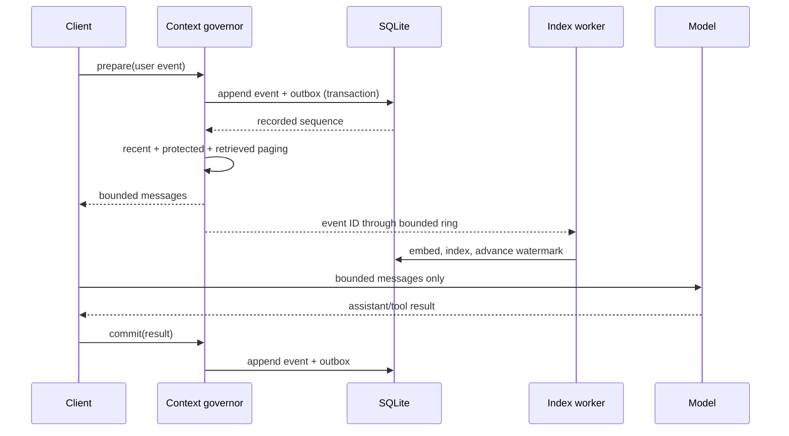

# Architecture

## Design objective

The Library controls context over-expansion and over-expiration without replacing the
model's native context. It uses the native window as a bounded working set and stores the
larger addressable history in local memory and disk.

## Invariants

1. An event is durable before it may leave the prompt.
2. The generated envelope stays inside its configured budget.
3. Recent unindexed events remain directly visible.
4. Work-ring overflow remains recoverable from the outbox.
5. Retrieved context replaces the previous desk.
6. SQLite is authoritative; RAM and Redis are disposable.
7. Remote services are never required for a local prompt.

## Control flow

## Two rings, two purposes

The recent ring is ordered thread context, bounded by event count and estimated tokens.
It supplies read-your-own-context semantics. The work ring is a bounded queue of event
IDs for derived indexing work. It may fill without losing context because the SQLite
outbox is durable.

## Memory tiers

| Tier | Purpose | Policy |
|---|---|---|
| Recent ring | Immediate thread overlay | FIFO, token and event bounds |
| Process RAM | Hot records and queries | Byte-estimated LRU |
| Local Redis | Shared disposable hot data | TTL and LFU |
| SQLite | Events, outbox, text, FTS, vectors | Authoritative disk store |
| Native context | Model-visible working set | Rebuilt under a token budget |

## Retrieval

The portable hybrid ranker combines exact vector similarity, bounded FTS rank,
importance, and recency. FTS returns candidate IDs directly. Vector search still exact
scores all live namespace records; a local ANN adapter is the main scaling requirement.

## Failure semantics

- A stop after append but before indexing is recovered from the outbox.
- A slow/down embedder does not hide the recent event.
- Redis loss falls through to SQLite.
- Strict freshness waits for the indexed watermark and may time out.
- Team/cloud loss does not disable local prompt construction.

The complete architecture, including limitations and team evolution, is maintained in
the repository's
[ARCHITECTURE.md](https://github.com/hwillGIT/library-of-context/blob/main/ARCHITECTURE.md).
