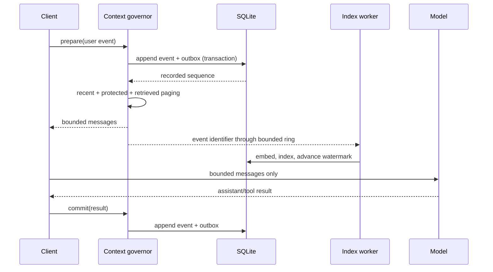

# Architecture

## Design objective

The Library of Context controls two context-window problems. Over-expansion occurs when a growing transcript fills the model input. Over-expiration occurs when useful information disappears too early.

The Library does not replace the model's native context window. It uses that window as a bounded working set. It stores more addressable history in memory and on disk.

A token is a small text unit that a model processes. SQLite is the embedded database that stores the authoritative Library data.

A reading desk is the bounded set of retrieved books for one thread and subject. A Library runtime owns the shared services for one database.

An outbox is a durable SQLite table of indexing work.

The [Glossary](GLOSSARY.md) defines shared technical terms. [Related Work and Design Landscape](RELATED_WORK.md) provides comparative evidence. [Capability Status](STATUS.md) lists support and limitations.

## Invariants

An invariant is a condition that the system must always preserve.

1. The Library stores an event on disk before it can remove the event from a prompt.
2. Each generated envelope stays within its configured token budget.
3. The bounded recent ring keeps recent events visible before indexing finishes.
4. The SQLite outbox retains indexing work when the bounded work ring is full.
5. Retrieved context replaces the prior reading desk.
6. The SQLite database is authoritative. Memory caches and the optional Redis key-value cache are disposable.
7. A local prompt does not require a remote service.

## Control flow

A watermark identifies the highest sequence that completed a processing stage without a gap. An atomic transaction applies all its changes or none.

The context governor controls the request boundary. It stores the user event and creates a bounded message list. The client sends only that list to the model.

An index worker converts the event into a searchable record. The worker also advances the watermark for indexing.

## Two rings with different purposes

The recent ring stores ordered thread context. It applies event-count and token limits. It gives a thread immediate access to its new events.

The work ring stores event identifiers for indexing. It is a bounded queue. A full work ring does not lose context because the SQLite outbox stores pending work.

## Events, records, and books

A context event is an authoritative, ordered fact in one governed chat. Asynchronous indexing derives one thread-scoped `ContextRecord` from that event.

A record is a stored retrieval unit. A book is the reader-facing view of that record. The database does not store a separate book entity.

Document ingestion can create several records from one source. Each event reserves its derived record identifier. Direct shelving cannot replace the event's record.

Each stateful operation uses `ThreadKey(collection, session_id)`. The collection identifies a project namespace. The session identifier identifies one chat thread within that namespace.

Each record has one visibility scope: thread, project, or team. Search, lookup, pinning, desk construction, and caching use the same scope route.

Promotion copies a record into a broader scope. It keeps the private source and its provenance. Provenance records where information came from.

## Memory tiers

| Tier | Purpose | Policy |
|---|---|---|
| Recent ring | Immediate thread context | First-in, first-out order with token and event limits |
| Process random-access memory | Frequently used records and queries | Least-recently-used eviction with an estimated byte limit |
| Local Redis | Disposable data for one runtime | Versioned key space, expiration time, and least-frequently-used eviction |
| SQLite | Events, outbox, text, full-text search, and vectors | Authoritative disk store |
| Native context | Model-visible working set | Rebuilt within a token budget |

First-in, first-out order removes the oldest item first. Least-recently-used eviction removes the item that the process accessed least recently.

## Retrieval

Hybrid retrieval combines full-text search with vector search. The portable hybrid ranker also uses explicit importance and recency.

Full-text search finds records that contain matching terms. Vector search compares numeric representations of meaning. The exact vector path scores every live record in a namespace.

A large catalog can require an approximate nearest-neighbor index. This index searches likely vector matches without scoring every record. Adoption requires measured latency, memory, and retrieval-quality evidence.

## Shared process runtime

One `LibraryOfContext` instance owns one shared runtime. The runtime contains the indexing pool, desk scheduler, thread registry, desk registry, SQLite store, and caches.

A chat adds only bounded thread state. This state contains a recent ring, an operation lock, and an optional desk snapshot. A chat does not create another worker pool.

The registries limit entries, content tokens, and idle time. They reconstruct evicted state from SQLite.

These limits do not impose a strict process-memory limit. Event metadata and selected search results can retain complete Python objects. The performance guide defines required memory measurements.

Every runtime owner locks the database before it opens SQLite. Only one embedded process or daemon can own a database. Other local clients use thin bridges.

A daemon is a background process that serves several clients. A thin bridge forwards requests to that daemon without opening the database.

Shutdown stops new operations and drains accepted work. It closes SQLite before it releases the owner lock. An incomplete shutdown remains in the `closing` state for another attempt.

Each embedded Model Context Protocol server owns a runtime. Model Context Protocol is a standard interface for agent tools and resources.

Several agents can share one runtime through thin standard-input and standard-output bridges. These bridges connect to one loopback daemon.

Loopback communication stays on the same computer. The daemon limits concurrent requests, rejects non-loopback addresses, and requires a bearer token on every route.

A bearer token is a secret value that grants access to its holder. The daemon rejects browser-origin requests and write requests that are not JavaScript Object Notation.

The service does not provide Transport Layer Security or multi-user authorization. Therefore, operators must not expose it to another computer.

## Failure behavior

- The outbox recovers an event when the process stops after storage but before indexing.
- The recent ring keeps an event visible when the embedding service is slow or unavailable.
- A Redis failure causes reads to use SQLite.
- A runtime restart uses a separate Redis key space and loads data from SQLite.
- Strict freshness waits for the indexed watermark and can reach its time limit.
- A team or cloud failure does not stop local prompt construction.

For schema, process, security, and team details, see the repository [Architecture](https://github.com/hwillGIT/library-of-context/blob/main/ARCHITECTURE.md).
