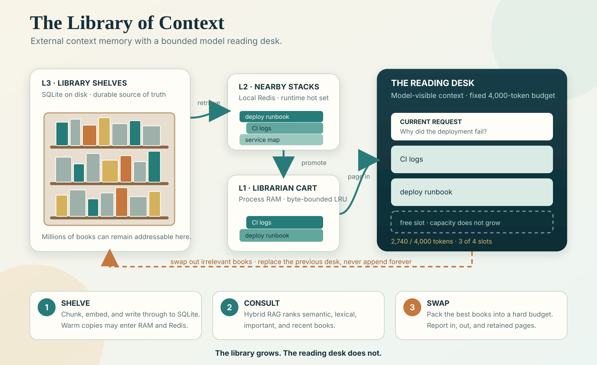

# The Library of Context

<div class="loc-hero" markdown>

**Virtual memory for AI context: durable outside the model, bounded inside it.**

The Library preserves complete agent threads outside the model and semantically pages
only protected, recent, and relevant context into each bounded model request.

[Get started](GETTING_STARTED.md){ .md-button .md-button--primary }
[Add it to your agent](ADD_TO_YOUR_AGENT.md){ .md-button }

</div>



## The idea

The model's native context is a reading desk. The Library holds the books that do not
currently fit. A context governor records every event before it can expire, keeps
critical and recent state resident, retrieves older relevant books, and replaces the
desk on each call.

```text
prepare(user event) -> bounded messages -> model -> commit(response)
       |                                      |
       +--------- durable SQLite history <----+
```

This is an alternative to making a compacted transcript the only continuation state.
Original events remain recoverable, while the model sees a fresh bounded working set.
The [related-work landscape](RELATED_WORK.md) places this boundary alongside long-context
models, retrieval, compaction, agent memory, checkpointing, and runtime paging.

## What you get

<div class="grid cards" markdown>

-   :material-shield-lock-outline: **Durable before evictable**

    Every governed event and its outbox entry commit before prompt construction.

-   :material-swap-horizontal: **Semantic paging**

    Protected, recent, and retrieved context replaces transcript accumulation.

-   :material-sync: **Immediate freshness**

    A token-aware recent ring overlays events while asynchronous indexing catches up.

-   :material-database: **Local-first storage**

    SQLite is authoritative; RAM and optional Redis are disposable accelerators.

-   :material-speedometer: **Observable pressure**

    Watermarks, queue occupancy, token pressure, and desk swap deltas are visible.

-   :material-account-group-outline: **Team memory (design only)**

    The proposed team design promotes selected knowledge without centralizing every
    prompt. Team sync is not implemented.

</div>

## Quick start

```powershell
py -3.11 -m venv .venv
.\.venv\Scripts\python.exe -m pip install -e .
.\.venv\Scripts\python.exe -m library_of_context quickstart
```

Redis is optional. This disposable self-test uses no Docker, cloud service, model API,
or retained data. macOS and Linux commands are in [Getting started](GETTING_STARTED.md).

```python
from library_of_context import LibraryOfContext

with LibraryOfContext("data/library.sqlite", redis_url="") as library:
    with library.open_context_governor("thread-1", token_budget=8_000) as context:
        context.protect("Production changes require a canary.")
        request = context.prepare("Diagnose the rollout failure.")

        # result = your_model(input=request.messages)

        context.commit("The health probe used the wrong port.")
```

!!! important
    Send only `request.messages` to the model. Adding the original full transcript again
    defeats the bounded-context invariant.

## Add it to an agent you already run

| Integration | What it adds |
|---|---|
| Cooperative MCP | Local shelving, retrieval, and a replaceable Library reading desk |
| Python text-agent wrapper | Automatic bounded context around every stateless model call |
| Loopback HTTP wrapper | The same automatic lifecycle for non-Python gateways |

An MCP tool cannot rewrite the host request that already invoked it. Automatic context
governance requires control of the model-call boundary. The
[agent integration guide](ADD_TO_YOUR_AGENT.md) gives tested, copy-and-paste paths and
explains how to isolate projects and threads.

## Alpha status

The lifecycle, recovery, and bounded-prompt behavior are implemented and tested. Exact
vector retrieval still scans a namespace, the tokenizer is approximate, and team sync
and ACLs are designs rather than shipped features. See
[Performance and scaling](PERFORMANCE_AND_SCALING.md) and the
[research agenda](roadmap.md).

Future components are conditional rather than mandatory. Read
[Why these improvements?](WHY_THE_ROADMAP.md) for the problem each proposal addresses,
the reasons to defer it, simpler alternatives, adoption triggers, and evidence gates.
The [capability status](STATUS.md) page separates implemented behavior from experiments
and future design.

Contributions that bring evidence, alternatives, failure tests, and privacy review are
especially welcome.
